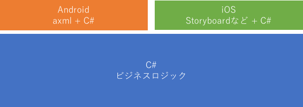
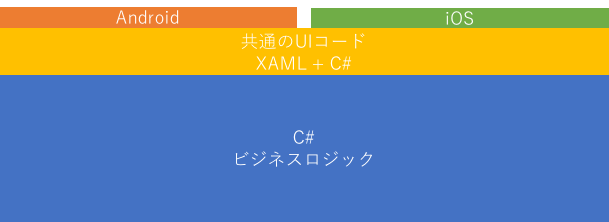

# はじめに

本サイトでは、Xamarin.Forms について説明しています。 Xamarin.Forms の基本から応用的なことまで幅広く記載して日本語による解説を行なっていきたいと思います。Xamarin.Forms の開発環境は Visual Studio, Visual Studio for Mac を使います。本サイトでは、特に IDE の使い方については記載しません。
Xamarin.Forms についてのみ解説を行います。また、C# の基本的な知識のある人を対象として解説を行います。

> C# について知りたいかたはこのサイトを参照してください : [++C++; // 未確認飛行 C](http://ufcpp.net/study/csharp/)

## ターゲットプラットフォーム

Xamarin.Forms は以下のプラットフォームのアプリケーションを開発可能です。

- Android
- iOS
- macOS
- UWP
- Tizen
- WPF
- etc...

本書では Android と iOS をターゲットとして解説を行います。

また、Xamarin.Forms のプロジェクトの形式として .NET Standard と Shared がありますが本サイトでは .NET Standard を使用して解説を行います。

Xamarin.Forms のバージョンは 2.5.0.x を使用しています。

## Xamarin.Forms とは

Xamarin とは C# で Android, iOS アプリケーションの開発が可能なプラットフォームで Mono をベースに作られています。Android と iOS のネイティブの API を C# から使えるようにラップしたものを Xamarin Native(海外では Traditional Xamarin とも言われてるみたいです)と言います。Xamarin Native では、ロジックは C# で共通化を行い UI は各プラットフォームの作法に従い作るという方法がとられています。

Xamarin が出た当初は、この方法しか開発の方法が無かったのですが、後から本書で解説する Xamarin.Forms が追加されました。Xamarin.Forms は XAML（ザムル）と呼ばれる XML をベースとしたマークアップ言語で UI を記述して UI 部分までコードを共通化するというものです。

これにより、ほぼ全て共通コードで Android, iOS アプリが作れるようになりました。本書では Android, iOS しか扱いませんが Xamarin.Forms 自体は先に示した通り様々なプラットフォームに対応しています。Xamarin.Forms の特徴は UI 部品のレンダリングは最終的にネイティブのコントロールが行なっているという点です。コードは共通化しつつ、ネイティブの見た目を手に入れることに成功しています。HTML/JavaScript などで UI まで共通化するタイプの Cordova などでは OS が変わっても見た目が共通だったものが Xamarin.Forms では、きちんと、そのプラットフォームの見た目になるという点が大きなアドバンテージです。最近は HTML/JavaScript ベースの UI フレームワークも OS によって見た目を変えてくると言ったことをしてくるので、必ずしもアドバンテージとは言えませんが HTML/JavaScript がエミュレートしている点に対して Xamarin.Forms は真のネイティブのコントロールを使用している点が特徴です。

