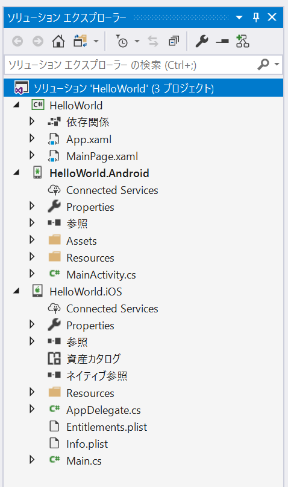
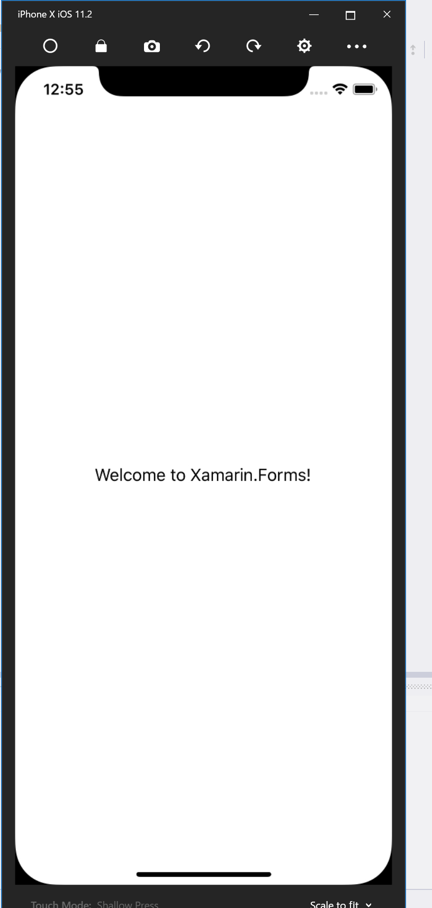
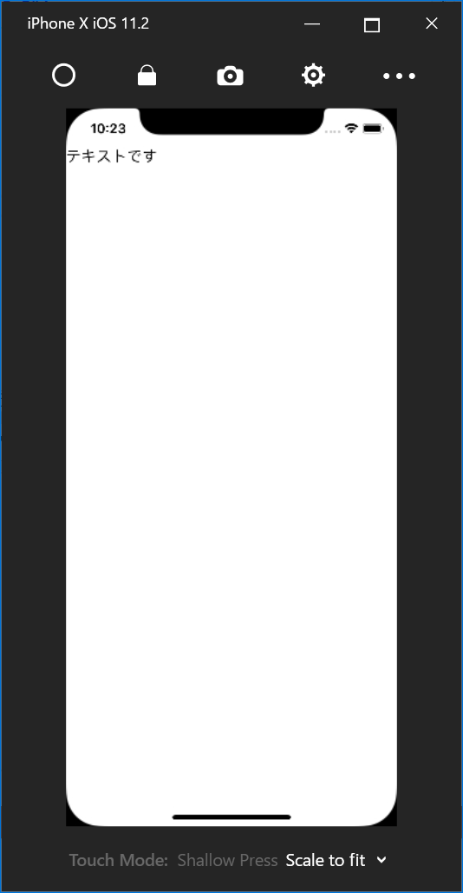

# Hello world

Xamarin.Forms での Hello world について解説します。Xamarin.Forms でプロジェクトを新規作成すると、どの IDE で行なっても以下のようなものが作成されます。



HelloWorld プロジェクトが .NET Standard のプロジェクトになります。基本的には、ここにロジックや画面などを記載していきます。HelloWorld.Android プロジェクトが Android のプロジェクトになります。このプロジェクトの MainActivity.cs が Android 上の実質的なエントリポイントになります。Xamarin.Forms の初期化処理が書かれています。

```cs
using System;

using Android.App;
using Android.Content.PM;
using Android.Runtime;
using Android.Views;
using Android.Widget;
using Android.OS;

namespace HelloWorld.Droid
{
    [Activity(Label = "HelloWorld", Icon = "@drawable/icon", Theme = "@style/MainTheme", MainLauncher = true, ConfigurationChanges = ConfigChanges.ScreenSize | ConfigChanges.Orientation)]
    public class MainActivity : global::Xamarin.Forms.Platform.Android.FormsAppCompatActivity
    {
        protected override void OnCreate(Bundle bundle)
        {
            TabLayoutResource = Resource.Layout.Tabbar;
            ToolbarResource = Resource.Layout.Toolbar;

            base.OnCreate(bundle);

            global::Xamarin.Forms.Forms.Init(this, bundle);
            LoadApplication(new App());
        }
    }
}
```

長いですが、基本的には global::Xamarin.Forms.Forms.Init(this, bundle) という行と LoadApplication(new App()) という行が初期化処理になります。次に HelloWorld.iOS プロジェクトを見ていきます。HelloWorld.iOS プロジェクトは、 AppDelegate.cs クラスがエントリポイントとなります。コードを以下に示します。

```cs
using System;
using System.Collections.Generic;
using System.Linq;

using Foundation;
using UIKit;

namespace HelloWorld.iOS
{
    // The UIApplicationDelegate for the application. This class is responsible for launching the 
    // User Interface of the application, as well as listening (and optionally responding) to 
    // application events from iOS.
    [Register("AppDelegate")]
    public partial class AppDelegate : global::Xamarin.Forms.Platform.iOS.FormsApplicationDelegate
    {
        //
        // This method is invoked when the application has loaded and is ready to run. In this 
        // method you should instantiate the window, load the UI into it and then make the window
        // visible.
        //
        // You have 17 seconds to return from this method, or iOS will terminate your application.
        //
        public override bool FinishedLaunching(UIApplication app, NSDictionary options)
        {
            global::Xamarin.Forms.Forms.Init();
            LoadApplication(new App());

            return base.FinishedLaunching(app, options);
        }
    }
}
```

iOS も global::Xamarin.Forms.Forms.Init() の行と LoadApplication(new App()) が Xamarin.Forms の初期化処理を行なっている部分になります。

次に LoadApplication メソッドに渡されている App クラスについて見てみます。App クラスは HelloWorld プロジェクトに App.xaml と App.xaml.cs の2つのファイルで構成されています。後述しますが XAML と呼ばれるマークアップ言語と、それに紐づいたコードビハインドクラスからできています。App.xaml.cs を開くと以下のようなコードになっています。

```cs
using System;
using System.Collections.Generic;
using System.Linq;
using System.Text;

using Xamarin.Forms;

namespace HelloWorld
{
	public partial class App : Application
	{
		public App ()
		{
			InitializeComponent();

			MainPage = new HelloWorld.MainPage();
		}

		protected override void OnStart ()
		{
			// Handle when your app starts
		}

		protected override void OnSleep ()
		{
			// Handle when your app sleeps
		}

		protected override void OnResume ()
		{
			// Handle when your app resumes
		}
	}
}
```

コンストラクタで MainPage プロパティに HelloWorld.MainPage を設定しています。Xamarin.Forms では、このように App クラスの MainPage プロパティにページを設定することで初期画面を設定できます。

では、次に HelloWorld.MainPage を見ていきたいと思います。
HelloWorld.MainPage も App クラスと同様に MainPage.xaml と MainPage.xaml.cs から構成されています。MainPage.xaml で画面の見た目を XAML で定義して MainPage.xaml.cs で画面の処理を C＃ で記述するという流れになります。見た目を定義している MainPage.xamlのコードを以下に示します。

```xml
<?xml version="1.0" encoding="utf-8" ?>
<ContentPage xmlns="http://xamarin.com/schemas/2014/forms"
             xmlns:x="http://schemas.microsoft.com/winfx/2009/xaml"
             xmlns:local="clr-namespace:HelloWorld"
             x:Class="HelloWorld.MainPage">

	<Label Text="Welcome to Xamarin.Forms!" 
           VerticalOptions="Center" 
           HorizontalOptions="Center" />

</ContentPage>
```

XAML は基本的に XML をベースとした言語になります。
詳細は後述しますが XML 名前空間が C＃ の名前空間に紐付きタグ名がクラス名に紐付き属性がプロパティに紐づくという感じになります。ここでは ContentPage という Xamarin.Forms の一般的なページに対して文字列を表示するための Label を中央寄せで配置しています。

最後に MainPage.xaml.cs を見ていきます。コードを以下に示します。

```cs
using System;
using System.Collections.Generic;
using System.Linq;
using System.Text;
using System.Threading.Tasks;
using Xamarin.Forms;

namespace HelloWorld
{
	public partial class MainPage : ContentPage
	{
		public MainPage()
		{
			InitializeComponent();
		}
	}
}
```

Xamarin.Forms の基本的なページである ContentPage を継承しています。

## 実行して動作確認

実行して動作確認をします。iOS と Android で実行すると以下のようになります。




## iPhone の余白への対応

iPhone X では画面上部にセンサーが配置されている領域があり画面が長方形ではありません。
そのため、何も考えずにコントロールを配置すると以下のように画面上部にコントロールが埋まってしまいます。

```xml
<?xml version="1.0" encoding="UTF-8"?>
<ContentPage xmlns="http://xamarin.com/schemas/2014/forms"
             xmlns:x="http://schemas.microsoft.com/winfx/2009/xaml"
             xmlns:local="clr-namespace:HelloWorld"
             x:Class="HelloWorld.MyPage">
    <Label Text="テキストです" />
</ContentPage>
```


また iPhone X 以外も iOS のアプリでは画面上部のステータスバー領域にコントロールがはみ出てしまいます。このため iOS のアプリでは機種に応じて適切な Padding の設定が必要になります。

以前はページに対して以下のような Padding を設定することで回避していました。

```xml
<ContentPage ...>
    <OnPlatform x:TypeArguments="Thickness">
      <On Platform="iOS" Value="0,20,0,0">
    </OnPlatform>
</ContentPage>
```

ただ、この方法では iPhone X では対応しきれません。そのため以下のような機能が追加されました。

[Making iOS 11 Even Easier with Xamarin.Forms](https://blog.xamarin.com/making-ios-11-even-easier-xamarin-forms/)

上記ページにあるように画面のコンストラクタに以下のコードを追加する必要があります。

```cs
// 以下の using を追加
// using Xamarin.Forms.PlatformConfiguration.iOSSpecific;

On<Xamarin.Forms.PlatformConfiguration.iOS>().SetUseSafeArea(true);
```

または、以下のように画面に UseSafeArea 属性を追加します。

```xml
<?xml version="1.0" encoding="UTF-8"?>
<ContentPage xmlns="http://xamarin.com/schemas/2014/forms"
             xmlns:x="http://schemas.microsoft.com/winfx/2009/xaml"
             xmlns:local="clr-namespace:HelloWorld"
             xmlns:ios="clr-namespace:Xamarin.Forms.PlatformConfiguration.iOSSpecific;assembly=Xamarin.Forms.Core"
             ios:Page.UseSafeArea="true"
             x:Class="HelloWorld.MyPage">
    <Label Text="テキストです" />
</ContentPage>
```

実行結果を以下に示します。



余白が適切に設定されていることが確認できます。


