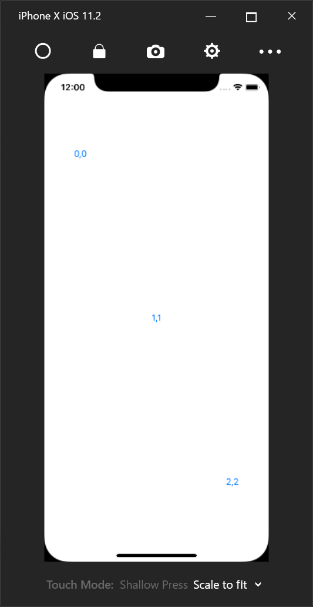
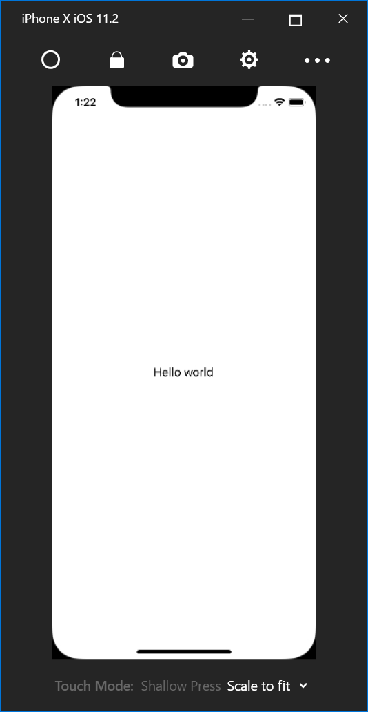
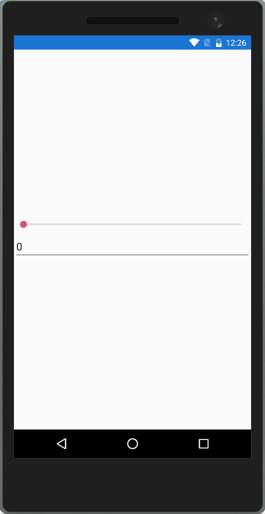
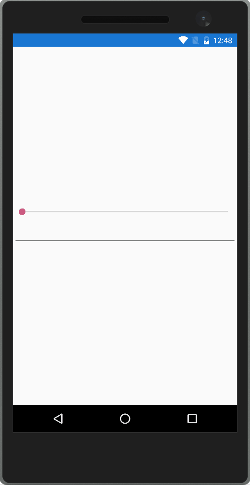
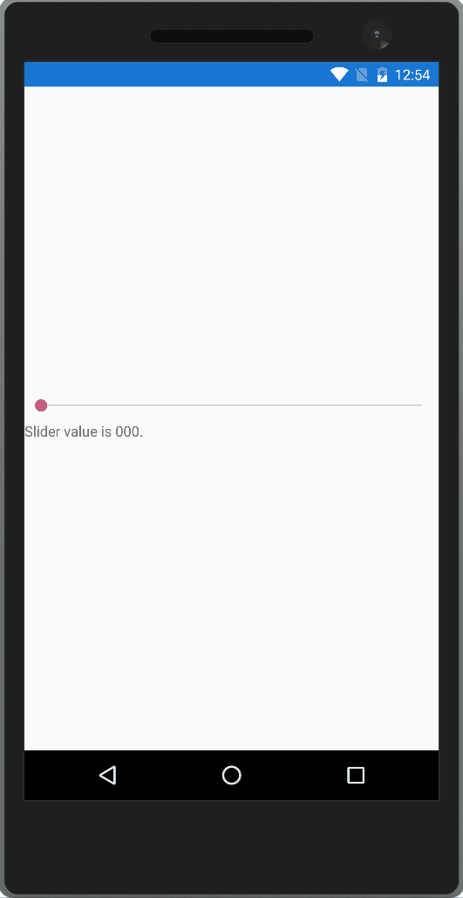
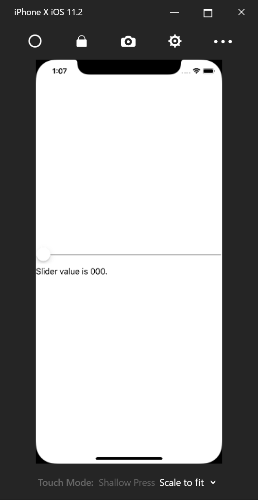
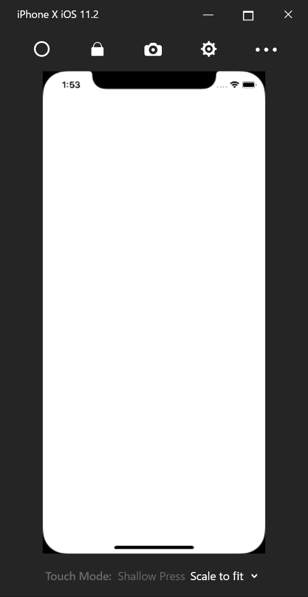

# XAML の応用

ここからは、XAMLの応用的なことについて説明していきます。

## 添付プロパティ

XAMLには、オブジェクトには本来存在していない他のクラスで定義されたプロパティを指定する添付プロパティというものが提供されています。添付プロパティは主に、画面レイアウトに必要な情報をコントロールに設定するために使用されます。一番わかりやすい例が Grid コントロールです。Grid コントロールは画面を格子状に区切って、そこにコントロールを配置するというレイアウトコントロールです。RowDefinitions プロパティで行を定義して ColumnDefinitions プロパティで行と列が何個あるのか定義します。定義したあとに、コントロールを Grid の中に配置していくのですがコントロールを何行何列目に配置するのかという設定を Grid に定義された添付プロパティで行います。以下に、3x3 の Grid に斜めに Button を置く場合のコード例を示します。

添付プロパティは、コード中の「Grid.Row=”1”」や「Grid.Column=”1”」といった「クラス名.プロパティ名」といった方法で指定している部分になります。実行結果を以下に示します。




## マークアップ拡張

XAML を使うことで、入れ子構造になった複雑な形状のオブジェクトを構築することができます。しかし XML という形式で表現するのが冗長であったり、そもそも XML で表現が難しいものも中にはあります。そういったものを表現するためにマークアップ拡張というものがあります。マークアップ拡張は、属性の設定値の中に「{マークアップ拡張名 プロパティ名=値, プロパティ名=値…}」のような形で記載をしていきます。特によく使われるマークアップ拡張として StaticResource マークアップ拡張をまず紹介します。

## StaticResource

StaticResource は Page などのコントロールに実装されている Resources プロパティに設定された ResourceDictionary の中で定義された要素を参照するために使用します。ResourceDictionary に共通の定義を追加することで文字列や色やスタイルなどを再利用することができます。ResourceDictionary に定義したオブジェクトは x:Key 属性で名前をつける必要があります。名前をつけると StaticResource マークアップ拡張の Key プロパティで指定して取得することができます。文字列を ResourceDictionary で定義して StaticResource で取得する XAML の例を以下に示します。

```xml
<?xml version="1.0" encoding="UTF-8"?>
<ContentPage xmlns="http://xamarin.com/schemas/2014/forms"
    xmlns:x="http://schemas.microsoft.com/winfx/2009/xaml"
    x:Class="HelloWorld.MyPage"
    Title="Hello world">
    <ContentPage.Resources>
        <ResourceDictionary>
            <x:String x:Key="text">Hello world</x:String>
        </ResourceDictionary>
    </ContentPage.Resources>
    <Label Text="{StaticResource text}"
        HorizontalOptions="Center"
        VerticalOptions="Center" />
</ContentPage>
```

実行すると Label に Hello world と表示されます。




## x:Static

x:Static マークアップ拡張は、クラスの static メンバーを呼び出すためのマークアップ拡張になります。以下のような static な Message プロパティを持った StaticItem クラスがあるとします。

```cs
namespace HelloWorld
{
    public static class StaticItem
    {
        public static string Message { get; } = "Hello static world";
    }
}
```

このクラスの Message プロパティを Label の Text プロパティに設定する XAML は以下のようになります。

```xml
<?xml version="1.0" encoding="UTF-8"?>
<ContentPage xmlns="http://xamarin.com/schemas/2014/forms"
    xmlns:x="http://schemas.microsoft.com/winfx/2009/xaml"
    xmlns:local="clr-namespace:HelloWorld;assembly=HelloWorld"
    x:Class="HelloWorld.MyPage"
    Title="Hello world">
    <Label Text="{x:Static local:StaticItem.Message}"
        HorizontalOptions="Center"
        VerticalOptions="Center" />
</ContentPage>
```

StaticItem クラスが定義されている名前空間を XML 名前空間とマッピングする定義を追加します。「xmlns:local=”clr-namespace:HelloWorld;assembly=HelloWorld”」が、その定義になります。clr-namespace で C# の名前空間を定義して assembly でアセンブリ名を定義します。XAML と同じアセンブリにある名前空間を指定する場合は、assembly は省略して「xmlns:local=”clr-namespace:HelloWorld”」のように書くこともできます。上記 XAML を実行すると Label に Hello static world と表示されます。


## TypeConverter

ここでは TypeConverter について説明します。TypeConverter は XAML で指定した文字列を特定の型に変換するための仕組みになります。例えば ContentPage の Padding プロパティは Thickness 型なのですが、以下のようにカンマ区切り文字列で指定可能です。

```xml
<?xml version="1.0" encoding="UTF-8"?>
<ContentPage xmlns="http://xamarin.com/schemas/2014/forms"
    xmlns:x="http://schemas.microsoft.com/winfx/2009/xaml"
    xmlns:local="clr-namespace:HelloWorld;assembly=HelloWorld"
    x:Class="HelloWorld.MyPage"
    Title="Hello world"
    Padding="0,20,0,0">
    <Label Text="{x:Static local:StaticItem.Message}"
        HorizontalOptions="Center"
        VerticalOptions="Center" />
</ContentPage>
```

## プラットフォーム固有の設定値の指定方法

Xamarin.Forms では複数のプラットフォームで XAML を共有して使用します。
大部分のコードは、共有可能なように作られていますが一部分に関しては OS ごとに固有の値を設定したいケースなども出てくると思います。

そのため、Xamarin.Forms では OnPlatform という仕組みが提供されています。
OnPlatform は型引数（x:TypeArguments で指定します）で扱う型を指定して On タグでプラットフォームごとに返す値を設定します。例えば iOS の場合に Hello iOS という値を返して Android の場合に Hello Android を返すような定義は以下のようになります。

```xml
<?xml version="1.0" encoding="UTF-8"?>
<ContentPage xmlns="http://xamarin.com/schemas/2014/forms"
             xmlns:x="http://schemas.microsoft.com/winfx/2009/xaml"
             xmlns:local="clr-namespace:HelloWorld;assembly=HelloWorld"
             xmlns:system="clr-namespace:System;assembly=netstandard"
             x:Class="HelloWorld.MyPage"
             Title="Hello world">
    <Label HorizontalOptions="Center"
           VerticalOptions="Center">
        <Label.Text>
            <OnPlatform x:TypeArguments="system:String">
                <On Platform="{x:Static Device.iOS}"
                    Value="Hello iOS" />
                <On Platform="{x:Static Device.Android}"
                    Value="Hello Android" />
            </OnPlatform>
        </Label.Text>
    </Label>
</ContentPage>
```

Xamarin.Forms が組み込みでサポートしているプラットフォーム名の定数は Device クラスに定義されています。上記 XAML ではその値を x:Static を使って参照しています。

実行すると以下のような結果になります。


この OnPlatform で行っているプラットフォームに応じて設定値を変えるという操作は C# では以下のように Device クラスの RuntimePlatform の値を見て処理を分けることで実現できます。

```cs
using System;
using Xamarin.Forms;

namespace HelloWorld
{
    public partial class MyPage : ContentPage
    {
        public MyPage()
        {
            InitializeComponent();

            switch (Device.RuntimePlatform)
            {
                case Device.iOS:
                    label.Text = "Hello iOS";
                    break;
                case Device.Android:
                    label.Text = "Hello Android";
                    break;
            }
        }
    }
}
```

## データ バインディング

ここでは XAML を用いたアプリケーション開発の中で最も重要な要素の 1 つであるデータ バインディングについて説明します。
データ バインディングは、ソース（任意のオブジェクトのプロパティ）とターゲット（BindableObject を継承したクラスで定義できる BindableProperty）の間の同期を取るための仕組みです。BindableObject を継承した BindableProperty は、ほとんどのコントロールのプロパティが該当するため実質的には画面のコントロールのプロパティと、任意のクラスのプロパティの同期を取るために使用されます。

### コントロール同士のデータバインディング

一番シンプルなデータ バインディングはコントロール同士のプロパティのデータ バインディングになります。データ バインディングは、Binding マークアップ拡張を使って指定します。Source プロパティにデータ バインディングのソースを指定して、Path プロパティに Source でデータバインディングしたいプロパティを指定します。Slider の Value プロパティと Label の Text プロパティの同期のコード例を以下に示します。

```xml
<?xml version="1.0" encoding="UTF-8"?>
<ContentPage xmlns="http://xamarin.com/schemas/2014/forms"
    xmlns:x="http://schemas.microsoft.com/winfx/2009/xaml"
    x:Class="HelloWorld.MyPage">
    <StackLayout VerticalOptions="Center">
        <Slider x:Name="slider"
            Maximum="100"
            Minimum="0"
            VerticalOptions="StartAndExpand" />
        <Label Text="{Binding Value, Source={x:Reference slider}}"
            HorizontalOptions="Center" />
    </StackLayout>
</ContentPage>
```

x:Reference で名前付きのコントロールのインスタンスを取得できるので、それを使用して Label の Text プロパティと Slider の Value プロパティをバインドしています。Binding マークアップ拡張では、Path プロパティは最初に書く場合省略可能なので上記の例では省略しています。このコードを実行すると以下のような結果になります。


### データ バインディングのモード

データバインディングには Mode というプロパティがあります。このプロパティを指定することで、データ バインディングの同期方向をカスタマイズすることができます。データ バインディングの Mode には以下のものが定義されています。

- Default：バインドしているターゲットのプロパティに指定されたデフォルトの値が使用される。
- OneWay；ソースからターゲットへの一方通行で同期される。
- OneWayToSource：ターゲットからソースへの一方通行で同期される。
- TwoWay：ソースとターゲット間の双方向で同期される。

先ほどの Slider と Label の同期から Slider と Entry（テキスト入力用コントロール）の同期にかえて動作を確認してみます。XAML を以下に示します。

```xml
<?xml version="1.0" encoding="UTF-8"?>
<ContentPage xmlns="http://xamarin.com/schemas/2014/forms"
             xmlns:x="http://schemas.microsoft.com/winfx/2009/xaml"
             x:Class="HelloWorld.MyPage">
    <StackLayout VerticalOptions="Center">
        <Slider x:Name="slider"
                Maximum="100"
                Minimum="0"
                HorizontalOptions="Fill" />
        <Entry Text="{Binding Value, Source={x:Reference slider}}"
               HorizontalOptions="Fill" />
    </StackLayout>
</ContentPage>
```

Entry の Text プロパティの Default の Mode は TwoWay なので Slider の値を変更すると Entry の中の Text が書き換わります。Entry の Text を 40 などのように書き換えると Slider のバーの位置が変わります。
Mode を明示的に書くと以下のようになります。（Entry タグのみ抜粋）

```xml
<Entry Text="{Binding Value, Source={x:Reference slider}, Mode=TwoWay}"
    HorizontalOptions="Fill" />
```





ここで Mode を OneWay にすると Entry の内容を書き換えても Slider に値が反映されなくなります。

```xml
<Entry Text="{Binding Value, Source={x:Reference slider}, Mode=OneWay}"
    HorizontalOptions="Fill" />
```

実行結果を以下に示します。


OneWayToSource は OneWay とは逆に Slider の値が変化しても Entry の中身が変わらなくなります。Entry の値の変更は Slider に反映されれます。XAML を以下に示します。

```xml
<Entry Text="{Binding Value, Source={x:Reference slider}, Mode=OneWayToSource}"
    HorizontalOptions="Fill" />
```

実行結果を以下に示します。




### StringFormat

次にデータ バインディングの出力のフォーマットについて説明します。データ バインディングの値の出力は StringFormat プロパティで書式指定することができます。C# の string.Format メソッドと同じ書式指定が使えます。コード例を以下に示します。

```xml
<?xml version="1.0" encoding="UTF-8"?>
<ContentPage xmlns="http://xamarin.com/schemas/2014/forms"
    xmlns:x="http://schemas.microsoft.com/winfx/2009/xaml"
    x:Class="HelloWorld.MyPage">
    <StackLayout VerticalOptions="Center">
        <Slider x:Name="slider"
            Maximum="100"
            Minimum="0"
            HorizontalOptions="Fill" />
        <Label Text="{Binding Value, Source={x:Reference slider}, StringFormat='Slider value is {0:000}.'}"
            HorizontalOptions="Fill" />
    </StackLayout>
</ContentPage>
```

実行すると以下のようになります。





StringFormatで指定した書式が設定されていることが確認できます。

### Converter

データ バインディングでは、ソースからターゲットに値が行くタイミングと、ターゲットからソースに値が行くタイミングで値の変換処理を入れることができます。Converter プロパティに IValueConverter インターフェースを実装したクラスを指定することが可能になります。 IValueConverter インターフェースは以下のように定義されています。

```cs
public interface IValueConverter
{
    object Convert(object value, Type targetType, object parameter, CultureInfo culture);

    object ConvertBack(object value, Type targetType, object parameter, CultureInfo culture);
}
```

Convert メソッドがソースからターゲットに行くときに呼ばれるメソッドになります。ConvertBack メソッドがターゲットからソースに行くときに呼ばれるメソッドになります。どちらのメソッドも、オリジナルの値、変換先の型、変換に使用するパラメータ、カルチャーインフォの値が渡ってくるので、これを使用して変換処理を行います。
例として StringFormat プロパティと同じ機能を持つ StringFormatConverter を作成してみます。この Converter はソースからターゲットに行くときにパラメータに指定した書式でフォーマットするというものになります。コード例を以下に示します。

```cs
using System;
using System.Globalization;
using Xamarin.Forms;

namespace HelloWorld
{
    public class StringFormatConverter : IValueConverter
    {
        public object Convert(object value, Type targetType, object parameter, CultureInfo culture)
        {
            return string.Format((string)parameter, value);
        }

        public object ConvertBack(object value, Type targetType, object parameter, CultureInfo culture)
        {
            throw new NotSupportedException();
        }
    }
}
```

Converter は Resources に定義して StaticResource マークアップ拡張で指定します。XAML を以下に示します。

```xml
<?xml version="1.0" encoding="UTF-8"?>
<ContentPage xmlns="http://xamarin.com/schemas/2014/forms"
    xmlns:x="http://schemas.microsoft.com/winfx/2009/xaml"
	xmlns:local="clr-namespace:HelloWorld"
    x:Class="HelloWorld.MyPage">
	<ContentPage.Resources>
        <ResourceDictionary>
            <local:StringFormatConverter x:Key="StringFormatConverter" />
        </ResourceDictionary>
    </ContentPage.Resources>
    <StackLayout VerticalOptions="Center">
        <Slider x:Name="slider"
            Maximum="100"
            Minimum="0"
            HorizontalOptions="Fill" />
        <Label Text="{Binding Value, Source={x:Reference slider}, Converter={StaticResource StringFormatConverter}, ConverterParameter='Slider value is {0:000}.'}"
            HorizontalOptions="Fill" />
    </StackLayout>
</ContentPage>
```

Converter プロパティに IValueConverter の実装を指定して ConverterParameter プロパティに Convert メソッドや ConvertBack メソッドの parameter 引数に渡される値を指定します。実行すると以下のようになります。




### BindingContext

ここでは、データ バインディングの BindingContext について説明します。BindingContext は、コントロールの親クラスをたどって行くとたどり着く BindableObject クラスに定義されているプロパティになります。このプロパティは、データ バインディングの Source プロパティが指定されていないときに暗黙的に Source として使われるというプロパティになります。さらに BindingContext は、コントロールの階層の親から子へと伝播して行くので Page の BindingContext に設定することで自動的に Page 内の全コントロールの Binding の Source が設定可能です。この特徴を利用して Page の BindingContext にオブジェクトを設定して、それとデータバインディングを行うことで C# のオブジェクトの世界と XAML の世界を接続するプログラミング モデルがよく採用されます。BindingContext に設定するオブジェクトは INotifyPropertyChanged インターフェースを実装していることが多くのケースにおいて望ましいです。データ バインディングは INotifyPropertyChanged インターフェースの PropertyChanged イベントを監視してデータの変更を検知してターゲットの値の更新を行います。逆にいうと INotifyPropertyChanged インターフェースを実装していないクラスを BindingContext に設定しても、ソースのプロパティが変わってもターゲットに伝搬されないため実質使い物になりません。

そのため、以下のような INotifyPropertyChanged の実装クラスを定義しておいて、そのクラスを継承する形で BindingContext に設定するクラスを定義するという方法がよく取られています。

```cs
using System.Collections.Generic;
using System.ComponentModel;
using System.Runtime.CompilerServices;

namespace HelloWorld
{
    public class BindableBase : INotifyPropertyChanged
    {
        protected BindableBase()
        {
        }

        public event PropertyChangedEventHandler PropertyChanged;

        protected virtual void OnPropertyChanged([CallerMemberName] string propertyName = null)
        {
            PropertyChanged?.Invoke(this, new PropertyChangedEventArgs(propertyName));
        }

        protected virtual bool SetProperty<T>(ref T field, T value, [CallerMemberName] string propertyName = null)
        {
            if (EqualityComparer<T>.Default.Equals(field, value)) { return false; }

            field = value;
            OnPropertyChanged(propertyName);
            return true;
        }
    }
}
```

そして、以下のようなクラスを BindingContext に設定します。

```cs
namespace HelloWorld
{
    public class MyPageViewModel : BindableBase
    {
        private double _sliderValue;

        public double SliderValue
        {
            get { return _sliderValue; }
            set { SetProperty(ref _sliderValue, value); OnPropertyChanged(nameof(LabelValue)); }
        }

        public string LabelValue => $"This is slider value '{SliderValue.ToString("000")}'";
    }
}
```

Page の BindingContext への設定は以下のように行います。


```xml
<?xml version="1.0" encoding="UTF-8"?>
<ContentPage xmlns="http://xamarin.com/schemas/2014/forms"
             xmlns:x="http://schemas.microsoft.com/winfx/2009/xaml"
             xmlns:local="clr-namespace:HelloWorld"
             x:Class="HelloWorld.MyPage">
    <ContentPage.BindingContext>
        <local:MyPageViewModel />
    </ContentPage.BindingContext>
    <StackLayout VerticalOptions="Center">
        <Slider Maximum="100"
                Minimum="0"
                HorizontalOptions="Fill"
                Value="{Binding SliderValue}" />
        <Label Text="{Binding LabelValue}"
               HorizontalOptions="Fill" />
    </StackLayout>
</ContentPage>
```

先ほど作成したクラスのインスタンスを BindingContext に設定して Slider と Label には BindingContext に設定したクラスのプロパティをデータ バインディングしています。プログラムの実行結果を以下に示します。


### コレクションのデータ バインディング

Xamarin.Forms では ListView というコントロールを使ってコレクションをデータ バインディングすることができます。コレクションのデータ バインディングは ItemsSource プロパティにコレクションをデータ バインディングすることで行います。
このとき、コレクションの要素の増減に対応するためには INotifyCollectionChanged インターフェースを実装して適切に CollectionChanged イベントを発行するコレクションである必要があります。
このような条件があるため通常 ItemsSource に設定する可変のコレクションは ObservableCollection&lt;T&gt; クラスという INotifyCollectionChanged インターフェースを実装したクラスを使用します。可変でない場合は IEnumerable&lt;T&gt; インターフェースでも List&lt;T&gt; クラスでも問題ありません。

コレクションのデータ バインディングを見ていきます。まず、コレクションに格納するための Person クラスを以下のように定義します。何の変哲も無いただの POCO です。

```cs
namespace HelloWorld
{
    public class Person
    {
        public string Name { get; set; }
    }
}
```

次に BindingContext に設定する MyPageViewModel のコードを以下に示します。1 秒ごとに新しい Person クラスが追加されます。Xamarin.Forms では Device クラスの StartTimer メソッドでタイマーを設定します。

```cs
using System;
using System.Collections.ObjectModel;
using Xamarin.Forms;

namespace HelloWorld
{
    public class MyPageViewModel : BindableBase
    {
        public ObservableCollection<Person> People { get; } = new ObservableCollection<Person>();

        public MyPageViewModel()
        {
            var r = new Random();
            Device.StartTimer(
                TimeSpan.FromSeconds(1),
                () =>
                {
                    People.Add(new Person { Name = $"tanaka {r.Next()}" });
                    return true;
                });
        }
    }
}
```

そして XAML で ListView の ItemsSource プロパティに People プロパティをデータバインディングします。XAML を以下に示します。

```xml
<?xml version="1.0" encoding="UTF-8"?>
<ContentPage xmlns="http://xamarin.com/schemas/2014/forms"
             xmlns:x="http://schemas.microsoft.com/winfx/2009/xaml"
             xmlns:local="clr-namespace:HelloWorld"
             x:Class="HelloWorld.MyPage">
    <ContentPage.BindingContext>
        <local:MyPageViewModel />
    </ContentPage.BindingContext>
    <ListView ItemsSource="{Binding People}">
    </ListView>
</ContentPage>
```

このプログラムを実行すると 1 秒ごとに ListView に要素が追加されていきます。実行結果を以下に示します。


デフォルトの挙動では ListView は ToString() の結果を表示します。ここの表示をカスタマイズするには ItemTemplate プロパティを設定する必要があります。ItemTemplate プロパティには DataTemplate を設定して、その中に Cell を設定します。Cell には様々な種類があるのですが、ここではテキストを表示するための TextCell を使用します。Person クラスの Name プロパティを表示する例を以下に示します。

```xml
<?xml version="1.0" encoding="UTF-8"?>
<ContentPage xmlns="http://xamarin.com/schemas/2014/forms"
             xmlns:x="http://schemas.microsoft.com/winfx/2009/xaml"
             xmlns:local="clr-namespace:HelloWorld"
             x:Class="HelloWorld.MyPage">
    <ContentPage.BindingContext>
        <local:MyPageViewModel />
    </ContentPage.BindingContext>
    <ListView ItemsSource="{Binding People}">
        <ListView.ItemTemplate>
            <DataTemplate>
                <TextCell Text="{Binding Name}" />
            </DataTemplate>
        </ListView.ItemTemplate>
    </ListView>
</ContentPage>
```

DataTemplate 内での BindingContext はコレクション内の要素になるため Binding の Path には Name を指定することで Person クラスの Name が表示されるようになります。実行結果を以下に示します。




### C# からのデータ バインディング

これまでデータ バインディングは全て XAML からやってきましたが C# からもデータ バインディングは指定できます。ここでは、その方法について説明します。C# からデータ バインディングができると動的にデータ バインディングができるようになります。
C# からデータ バインディングを行うには BindableObject クラスの SetBinding メソッドを使います。つまりコントロールのクラスの SetBinding メソッドを呼ぶことになります。SetBinding メソッドには Binding のターゲットとなるプロパティ、パス、モード、コンバーター、StringFormat を指定します。必須なのはターゲットとなるプロパティとパスの 2 つです。ターゲットとなるプロパティは、コントロールのクラスの静的な変数として定義されています。例として Label の Text プロパティに Name を TwoWay バインディングするコードを以下に示します。

```cs
label.SetBinding(
    Label.TextProperty,
    "Name",
    BindingMode.TwoWay);
```
