# XAML

ここでは Xamarin.Forms で UI を記述するための言語である XAML について説明します。XAML とは XML をベースとした言語です。XML なのでツリー状の構造を持ったものを記述するのに向いています。UI はページをルートとしたツリー構造のものなので UI を記述するのに非常に親和性が高い言語となっています。では XAML について解説していきます。

## XAML と C# のコードの対比

XAML はオブジェクトのインスタンスを組み立てるための言語です。
オブジェクトのインスタンスを組み立てるだけなら C# でも可能です。
実際に XAML を使わずに C# で画面部品を組み立てた Xamarin.Forms のサンプルプログラムやリリースされているプログラムもあります。
本書では C# による画面構築は基本的に行わずに XAML を主体とした画面構築を行います。それでは XAML を見て行ってみましょう。

### XAML の基本

XAML は Xamarin.Forms のページを作成するのに使われます。では、ページを作成してみましょう。IDE によって若干生成されるページのコードは異なりますがおおむね以下のようになります。

```xml
<?xml version="1.0" encoding="UTF-8"?>
<ContentPage xmlns="http://xamarin.com/schemas/2014/forms" 
    xmlns:x="http://schemas.microsoft.com/winfx/2009/xaml"  
    x:Class="HelloWorld.MyPage">
</ContentPage>
```

XAML ではタグ名がクラス名に該当します。つまり、これは ContentPage クラスのインスタンスを組み立てているということになります。いくつか XML 名前空間が定義されています。`http://xamarin.com/schemas/2014/forms` 名前空間は Xamarin.Forms のクラスが定義されている特別な名前空間です。
`x`名前空間の `http://schemas.microsoft.com/winfx/2009/xaml` も XAML 内で使用する様々なクラスが定義された名前空間になります。
この 2 つの名前空間は新規作成するとデフォルトで付いてくるものなので自分で打つ必要はありませんが特別なものだと覚えておきましょう。`x:Class`属性はコードビハインドと XAML ファイルを紐づけるためのタグになります。
コードビハインドクラスは HelloWorld.MyPage クラスであるということが定義されています。

XAML では XML の属性が C# のプロパティの設定に該当します。
ContentPage クラスには string 型の Title プロパティがあるので、それに Hello world を設定すると XAML は以下のようになります。

```xml
<?xml version="1.0" encoding="UTF-8"?>
<ContentPage xmlns="http://xamarin.com/schemas/2014/forms"
    xmlns:x="http://schemas.microsoft.com/winfx/2009/xaml"
    x:Class="HelloWorld.MyPage"
    Title="Hello world">
</ContentPage>
```

C# のコードで表すと以下のようなイメージになります。

```cs
var page = new ContentPage
{
    Title = “Hello world”,
};
```

ContentPage にコントロールを配置するには object 型の Content プロパティにコントロールを配置していきます。
各種コントロールのような複雑なオブジェクトをプロパティに設定するための構文として、プロパティ要素構文というものがあります。これは、タグ名としてプロパティを定義するための構文で、「クラス名.プロパティ名」という形でタグを書くことで、タグとしてプロパティを設定できます。こうすることでオブジェクトのような複雑な型をプロパティに設定することができます。例えば ContentPage に Hello world と設定した Label （テキストを表示するためのコントロール）を設定した XAML を以下に示します。

```xml
<?xml version="1.0" encoding="UTF-8"?>
<ContentPage xmlns="http://xamarin.com/schemas/2014/forms"
    xmlns:x="http://schemas.microsoft.com/winfx/2009/xaml"
    x:Class="HelloWorld.MyPage"
    Title="Hello world">
    <ContentPage.Content>
        <Label Text="Hello world" />
    </ContentPage.Content>
</ContentPage>
```

XAML では 1 つのクラスに対して 1 つのコンテンツ プロパティを定義することができます。コンテンツ プロパティは XAML でタグを省略した時に設定されるデフォルトのプロパティのことです。ややこしいのですが ContentPage コントロールは Content プロパティがコンテンツ プロパティとして定義されています。そのため ContentPage.Content のタグは省略できるため上記の XAML は以下のように書くことができます。


```xml
<?xml version="1.0" encoding="UTF-8"?>
<ContentPage xmlns="http://xamarin.com/schemas/2014/forms"
    xmlns:x="http://schemas.microsoft.com/winfx/2009/xaml"
    x:Class="HelloWorld.MyPage"
    Title="Hello world">
    <Label Text="Hello world" />
</ContentPage>
```

複数のコントロールをページに置いてみましょう。
ContentPage クラスの Content プロパティは単一の要素しか置けないため、複数のコントロールを配置するときは要素のレイアウトを行うコントロールを置いて、その中にコントロールを配置して行います。よく使われるレイアウト コントロールとして StackLayout というクラスがあります。これは子要素を縦や横に並べるコントロールです。StackLayout コントロールには Children プロパティというコレクション型のプロパティがあり、そこにコントロールを追加していきます。

コレクション型のプロパティに対して要素を追加するにはコレクション構文というものがあり、コレクションのプロパティに対して直接子要素を設定することでコレクションに設定させることができます。そのため StackLayout に対して Label コントロールと Button コントロールを配置するには以下のように書くことができます。

また、水平方向と垂直方向に中央に表示させるための HorizontalOptions プロパティと VerticalOpeions プロパティの設定もあわせて行っています。


```xml
<?xml version="1.0" encoding="UTF-8"?>
<ContentPage xmlns="http://xamarin.com/schemas/2014/forms"
             xmlns:x="http://schemas.microsoft.com/winfx/2009/xaml"
             x:Class="HelloWorld.MyPage"
             Title="Hello world">
    <StackLayout HorizontalOptions="Center"
                 VerticalOptions="Center">
        <Label x:Name="labelHelloWorld"
               Text="Hello world" />
        <Button Text="Click me" />
    </StackLayout>
</ContentPage>
</ContentPage>
```

次にイベントを設定する方法を示します。各コントロールには様々なユーザーの操作に対応するためのイベントが定義されています。代表的なものとして Button コントロールの Clicked イベントがあります。名前の通り Button がタップされたときに起きるイベントです。イベントはプロパティの設定と同じように「イベント名=”イベントハンドラ名”」という形式で記述します。イベントハンドラは各種イベントに応じた引数を受け取るメソッドで、コードビハインド クラスに定義されます。では上記の XAML に対して Button の Clicked イベントに OnClicked イベントを割り当ててみましょう。
XAML を以下に示します。

```xml
<?xml version="1.0" encoding="UTF-8"?>
<ContentPage xmlns="http://xamarin.com/schemas/2014/forms"
             xmlns:x="http://schemas.microsoft.com/winfx/2009/xaml"
             x:Class="HelloWorld.MyPage"
             Title="Hello world">
    <StackLayout HorizontalOptions="Center"
                 VerticalOptions="Center">
        <Label x:Name="labelHelloWorld"
               Text="Hello world" />
        <Button Text="Click me"
                Clicked="OnClicked" />
    </StackLayout>
</ContentPage>
```

コードビハインドで OnClicked というメソッドを定義します。以下にコードを示します。

```cs
using System;
using Xamarin.Forms;

namespace HelloWorld
{
    public partial class MyPage : ContentPage
    {
        public MyPage()
        {
            InitializeComponent();
        }

        private void OnClicked(object sender, EventArgs args)
        {
            // ここに処理を書く
        }
    }
}
```

コードビハインドからコントロールを触るには x:Name という属性を使用します。`x`名前空間には特殊な動きをする様々な属性や要素が定義されています。詳細はリファレンスをみてください。本サイトでは代表的なものについて適時説明していきます。

> x名前空間で定義されているもののリストのあるページ
> https://developer.xamarin.com/guides/xamarin-forms/xaml/namespaces/

では Label に x:Name 属性で名前をつけて Button がタップされた時に Text プロパティを書き換えるようにしてみたいと思います。まず XAML で Label に `x:Name=”labelHelloWorld”` という形で名前をつけます。

```xml
<Label x:Name="labelHelloWorld"
    Text="Hello world" />
```

そして、先ほどコードビハインドに定義した OnClicked イベント ハンドラに以下のように処理を記述します。

```cs
private void OnClicked(object sender, EventArgs args)
{
    this.labelHelloWorld.Text = "こんにちは世界";
}
```

この状態で実行すると以下のように Button を押すと Label の Text が書き換わります。
Button の選択前は Hello world と表示されていますが Button を選択すると こんにちは世界 に Label の Text が書き換わります。

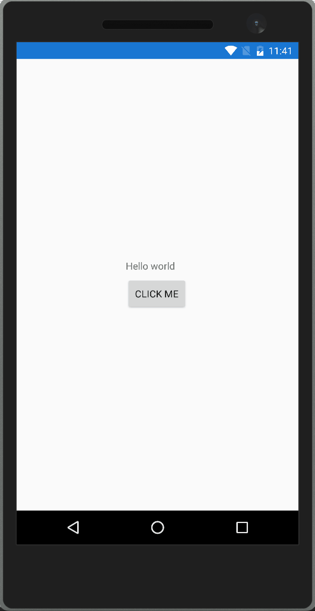

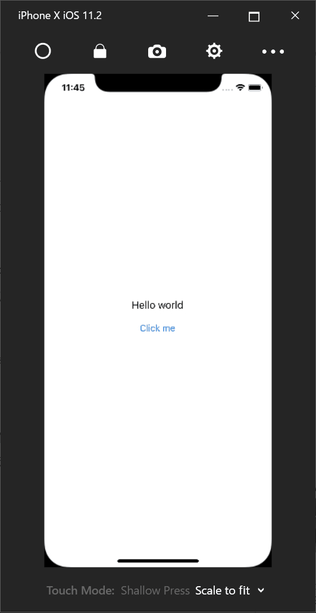

以上が、XAMLを使用してアプリケーションを組む場合に必要最低限必要な部分になります。

## XAML の応用

ここからは、XAMLの応用的なことについて説明していきます。

### 添付プロパティ

XAMLには、オブジェクトには本来存在していない他のクラスで定義されたプロパティを指定する添付プロパティというものが提供されています。添付プロパティは主に、画面レイアウトに必要な情報をコントロールに設定するために使用されます。一番わかりやすい例が Grid コントロールです。Grid コントロールは画面を格子状に区切って、そこにコントロールを配置するというレイアウトコントロールです。RowDefinitions プロパティで行を定義して ColumnDefinitions プロパティで行と列が何個あるのか定義します。定義したあとに、コントロールを Grid の中に配置していくのですがコントロールを何行何列目に配置するのかという設定を Grid に定義された添付プロパティで行います。以下に、3x3 の Grid に斜めに Button を置く場合のコード例を示します。

添付プロパティは、コード中の「Grid.Row=”1”」や「Grid.Column=”1”」といった「クラス名.プロパティ名」といった方法で指定している部分になります。実行結果を以下に示します。

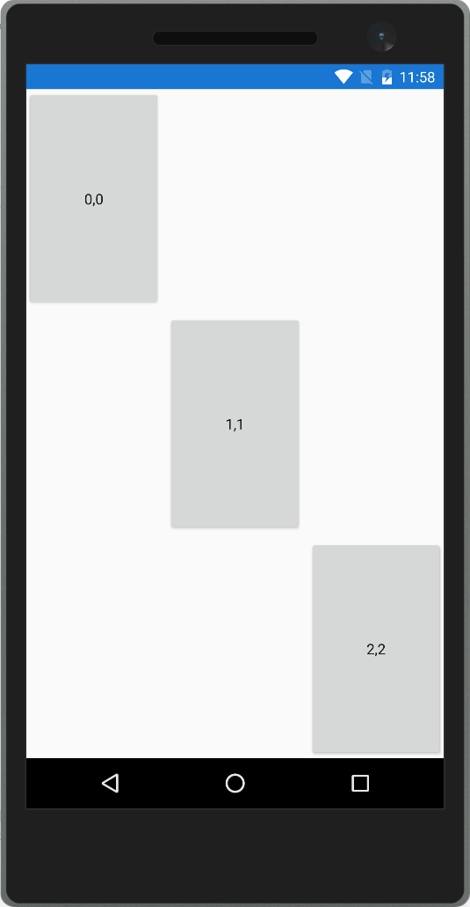

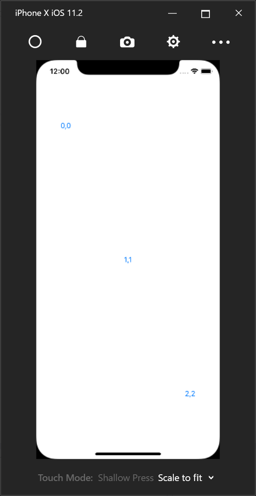

### マークアップ拡張

XAML を使うことで、入れ子構造になった複雑な形状のオブジェクトを構築することができます。しかし XML という形式で表現するのが冗長であったり、そもそも XML で表現が難しいものも中にはあります。そういったものを表現するためにマークアップ拡張というものがあります。マークアップ拡張は、属性の設定値の中に「{マークアップ拡張名 プロパティ名=値, プロパティ名=値…}」のような形で記載をしていきます。特によく使われるマークアップ拡張として StaticResource マークアップ拡張をまず紹介します。

### StaticResource

StaticResource は Page などのコントロールに実装されている Resources プロパティに設定された ResourceDictionary の中で定義された要素を参照するために使用します。ResourceDictionary に共通の定義を追加することで文字列や色やスタイルなどを再利用することができます。ResourceDictionary に定義したオブジェクトは x:Key 属性で名前をつける必要があります。名前をつけると StaticResource マークアップ拡張の Key プロパティで指定して取得することができます。文字列を ResourceDictionary で定義して StaticResource で取得する XAML の例を以下に示します。

```xml
<?xml version="1.0" encoding="UTF-8"?>
<ContentPage xmlns="http://xamarin.com/schemas/2014/forms"
    xmlns:x="http://schemas.microsoft.com/winfx/2009/xaml"
    x:Class="HelloWorld.MyPage"
    Title="Hello world">
    <ContentPage.Resources>
        <ResourceDictionary>
            <x:String x:Key="text">Hello world</x:String>
        </ResourceDictionary>
    </ContentPage.Resources>
    <Label Text="{StaticResource text}"
        HorizontalOptions="Center"
        VerticalOptions="Center" />
</ContentPage>
```

実行すると Label に Hello world と表示されます。

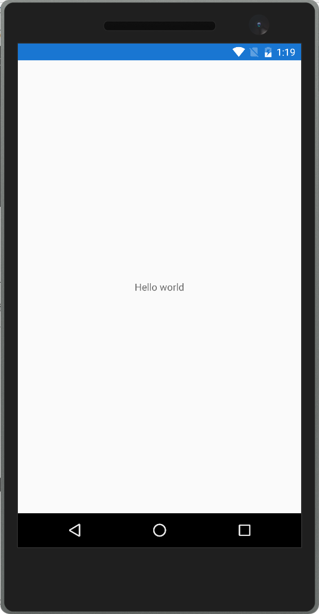

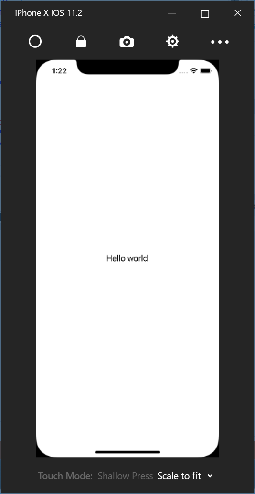

### x:Static

x:Static マークアップ拡張は、クラスの static メンバーを呼び出すためのマークアップ拡張になります。以下のような static な Message プロパティを持った StaticItem クラスがあるとします。

```cs
namespace HelloWorld
{
    public static class StaticItem
    {
        public static string Message { get; } = "Hello static world";
    }
}
```

このクラスの Message プロパティを Label の Text プロパティに設定する XAML は以下のようになります。

```xml
<?xml version="1.0" encoding="UTF-8"?>
<ContentPage xmlns="http://xamarin.com/schemas/2014/forms"
    xmlns:x="http://schemas.microsoft.com/winfx/2009/xaml"
    xmlns:local="clr-namespace:HelloWorld;assembly=HelloWorld"
    x:Class="HelloWorld.MyPage"
    Title="Hello world">
    <Label Text="{x:Static local:StaticItem.Message}"
        HorizontalOptions="Center"
        VerticalOptions="Center" />
</ContentPage>
```

StaticItem クラスが定義されている名前空間を XML 名前空間とマッピングする定義を追加します。「xmlns:local=”clr-namespace:HelloWorld;assembly=HelloWorld”」が、その定義になります。clr-namespace で C# の名前空間を定義して assembly でアセンブリ名を定義します。XAML と同じアセンブリにある名前空間を指定する場合は、assembly は省略して「xmlns:local=”clr-namespace:HelloWorld”」のように書くこともできます。上記 XAML を実行すると Label に Hello static world と表示されます。


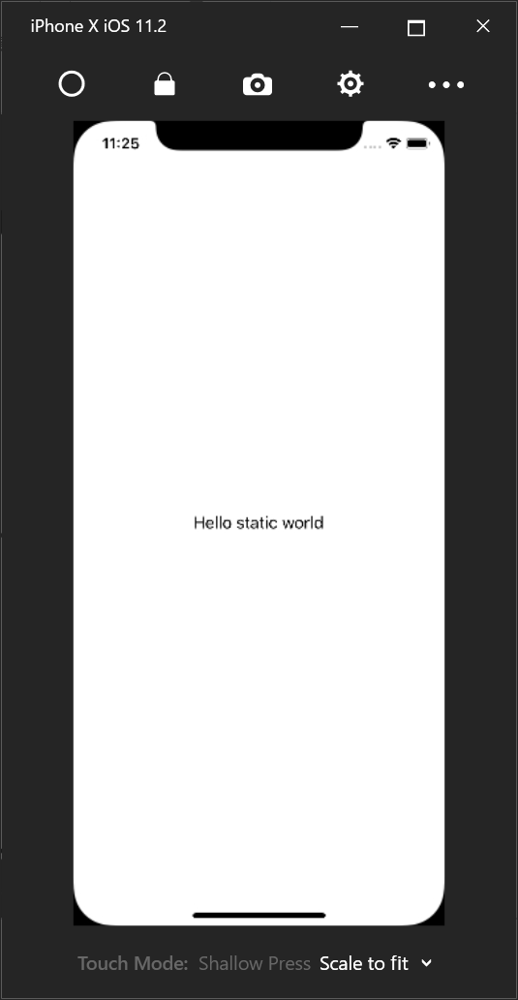

### TypeConverter

ここでは TypeConverter について説明します。TypeConverter は XAML で指定した文字列を特定の型に変換するための仕組みになります。例えば ContentPage の Padding プロパティは Thickness 型なのですが、以下のようにカンマ区切り文字列で指定可能です。

```xml
<?xml version="1.0" encoding="UTF-8"?>
<ContentPage xmlns="http://xamarin.com/schemas/2014/forms"
    xmlns:x="http://schemas.microsoft.com/winfx/2009/xaml"
    xmlns:local="clr-namespace:HelloWorld;assembly=HelloWorld"
    x:Class="HelloWorld.MyPage"
    Title="Hello world"
    Padding="0,20,0,0">
    <Label Text="{x:Static local:StaticItem.Message}"
        HorizontalOptions="Center"
        VerticalOptions="Center" />
</ContentPage>
```

### プラットフォーム固有の設定値の指定方法

Xamarin.Forms では複数のプラットフォームで XAML を共有して使用します。
大部分のコードは、共有可能なように作られていますが一部分に関しては OS ごとに固有の値を設定したいケースなども出てくると思います。

そのため、Xamarin.Forms では OnPlatform という仕組みが提供されています。
OnPlatform は型引数（x:TypeArguments で指定します）で扱う型を指定して On タグでプラットフォームごとに返す値を設定します。例えば iOS の場合に Hello iOS という値を返して Android の場合に Hello Android を返すような定義は以下のようになります。

```xml
<?xml version="1.0" encoding="UTF-8"?>
<ContentPage xmlns="http://xamarin.com/schemas/2014/forms"
             xmlns:x="http://schemas.microsoft.com/winfx/2009/xaml"
             xmlns:local="clr-namespace:HelloWorld;assembly=HelloWorld"
             xmlns:system="clr-namespace:System;assembly=netstandard"
             x:Class="HelloWorld.MyPage"
             Title="Hello world">
    <Label HorizontalOptions="Center"
           VerticalOptions="Center">
        <Label.Text>
            <OnPlatform x:TypeArguments="system:String">
                <On Platform="{x:Static Device.iOS}"
                    Value="Hello iOS" />
                <On Platform="{x:Static Device.Android}"
                    Value="Hello Android" />
            </OnPlatform>
        </Label.Text>
    </Label>
</ContentPage>
```

Xamarin.Forms が組み込みでサポートしているプラットフォーム名の定数は Device クラスに定義されています。上記 XAML ではその値を x:Static を使って参照しています。

実行すると以下のような結果になります。

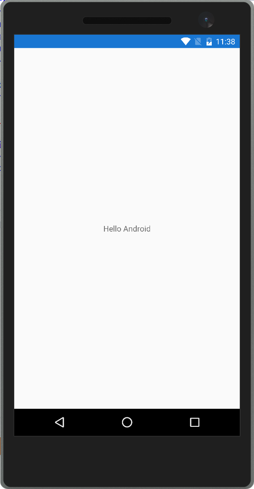


この OnPlatform で行っているプラットフォームに応じて設定値を変えるという操作は C# では以下のように Device クラスの RuntimePlatform の値を見て処理を分けることで実現できます。

```cs
using System;
using Xamarin.Forms;

namespace HelloWorld
{
    public partial class MyPage : ContentPage
    {
        public MyPage()
        {
            InitializeComponent();

            switch (Device.RuntimePlatform)
            {
                case Device.iOS:
                    label.Text = "Hello iOS";
                    break;
                case Device.Android:
                    label.Text = "Hello Android";
                    break;
            }
        }
    }
}
```

### データ バインディング

ここでは XAML を用いたアプリケーション開発の中で最も重要な要素の 1 つであるデータ バインディングについて説明します。
データ バインディングは、ソース（任意のオブジェクトのプロパティ）とターゲット（BindableObject を継承したクラスで定義できる BindableProperty）の間の同期を取るための仕組みです。BindableObject を継承した BindableProperty は、ほとんどのコントロールのプロパティが該当するため実質的には画面のコントロールのプロパティと、任意のクラスのプロパティの同期を取るために使用されます。

#### コントロール同士のデータバインディング

一番シンプルなデータ バインディングはコントロール同士のプロパティのデータ バインディングになります。データ バインディングは、Binding マークアップ拡張を使って指定します。Source プロパティにデータ バインディングのソースを指定して、Path プロパティに Source でデータバインディングしたいプロパティを指定します。Slider の Value プロパティと Label の Text プロパティの同期のコード例を以下に示します。

```xml
<?xml version="1.0" encoding="UTF-8"?>
<ContentPage xmlns="http://xamarin.com/schemas/2014/forms"
    xmlns:x="http://schemas.microsoft.com/winfx/2009/xaml"
    x:Class="HelloWorld.MyPage">
    <StackLayout VerticalOptions="Center">
        <Slider x:Name="slider"
            Maximum="100"
            Minimum="0"
            VerticalOptions="StartAndExpand" />
        <Label Text="{Binding Value, Source={x:Reference slider}}"
            HorizontalOptions="Center" />
    </StackLayout>
</ContentPage>
```

x:Reference で名前付きのコントロールのインスタンスを取得できるので、それを使用して Label の Text プロパティと Slider の Value プロパティをバインドしています。Binding マークアップ拡張では、Path プロパティは最初に書く場合省略可能なので上記の例では省略しています。このコードを実行すると以下のような結果になります。


#### データ バインディングのモード

データバインディングには Mode というプロパティがあります。このプロパティを指定することで、データ バインディングの同期方向をカスタマイズすることができます。データ バインディングの Mode には以下のものが定義されています。

- Default：バインドしているターゲットのプロパティに指定されたデフォルトの値が使用される。
- OneWay；ソースからターゲットへの一方通行で同期される。
- OneWayToSource：ターゲットからソースへの一方通行で同期される。
- TwoWay：ソースとターゲット間の双方向で同期される。

先ほどの Slider と Label の同期から Slider と Entry（テキスト入力用コントロール）の同期にかえて動作を確認してみます。XAML を以下に示します。

```xml
<?xml version="1.0" encoding="UTF-8"?>
<ContentPage xmlns="http://xamarin.com/schemas/2014/forms"
             xmlns:x="http://schemas.microsoft.com/winfx/2009/xaml"
             x:Class="HelloWorld.MyPage">
    <StackLayout VerticalOptions="Center">
        <Slider x:Name="slider"
                Maximum="100"
                Minimum="0"
                HorizontalOptions="Fill" />
        <Entry Text="{Binding Value, Source={x:Reference slider}}"
               HorizontalOptions="Fill" />
    </StackLayout>
</ContentPage>
```

Entry の Text プロパティの Default の Mode は TwoWay なので Slider の値を変更すると Entry の中の Text が書き換わります。Entry の Text を 40 などのように書き換えると Slider のバーの位置が変わります。
Mode を明示的に書くと以下のようになります。（Entry タグのみ抜粋）

```xml
<Entry Text="{Binding Value, Source={x:Reference slider}, Mode=TwoWay}"
    HorizontalOptions="Fill" />
```


ここで Mode を OneWay にすると Entry の内容を書き換えても Slider に値が反映されなくなります。

```xml
<Entry Text="{Binding Value, Source={x:Reference slider}, Mode=OneWay}"
    HorizontalOptions="Fill" />
```

実行結果を以下に示します。

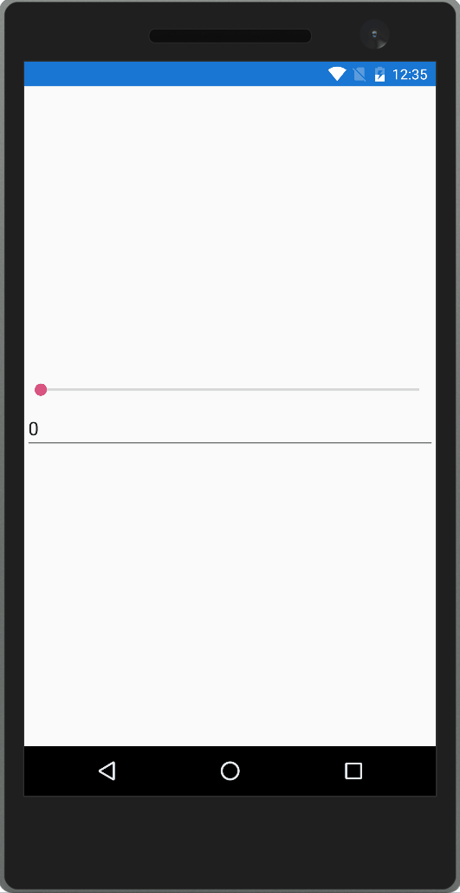


OneWayToSource は OneWay とは逆に Slider の値が変化しても Entry の中身が変わらなくなります。Entry の値の変更は Slider に反映されれます。XAML を以下に示します。

```xml
<Entry Text="{Binding Value, Source={x:Reference slider}, Mode=OneWayToSource}"
    HorizontalOptions="Fill" />
```

実行結果を以下に示します。

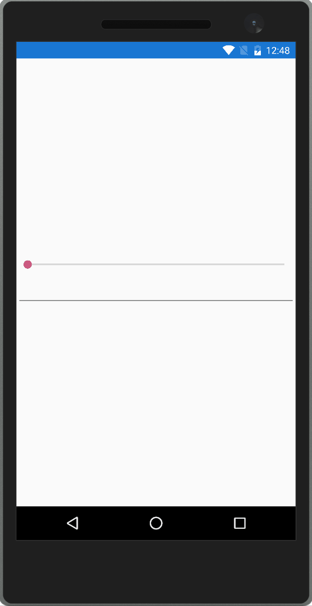


#### StringFormat

次にデータ バインディングの出力のフォーマットについて説明します。データ バインディングの値の出力は StringFormat プロパティで書式指定することができます。C# の string.Format メソッドと同じ書式指定が使えます。コード例を以下に示します。

```xml
<?xml version="1.0" encoding="UTF-8"?>
<ContentPage xmlns="http://xamarin.com/schemas/2014/forms"
    xmlns:x="http://schemas.microsoft.com/winfx/2009/xaml"
    x:Class="HelloWorld.MyPage">
    <StackLayout VerticalOptions="Center">
        <Slider x:Name="slider"
            Maximum="100"
            Minimum="0"
            HorizontalOptions="Fill" />
        <Label Text="{Binding Value, Source={x:Reference slider}, StringFormat='Slider value is {0:000}.'}"
            HorizontalOptions="Fill" />
    </StackLayout>
</ContentPage>
```

実行すると以下のようになります。


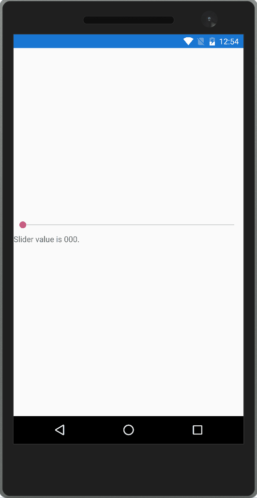

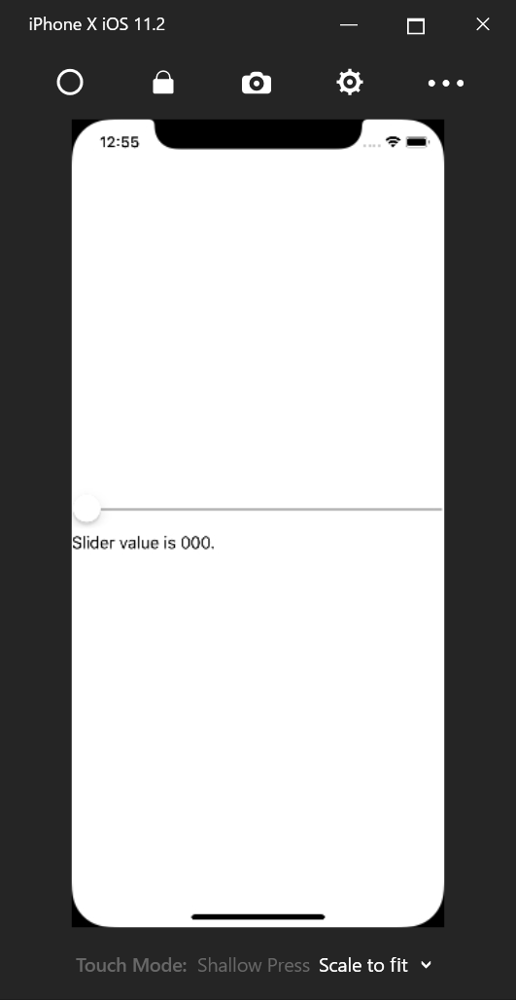

StringFormatで指定した書式が設定されていることが確認できます。

#### Converter

データ バインディングでは、ソースからターゲットに値が行くタイミングと、ターゲットからソースに値が行くタイミングで値の変換処理を入れることができます。Converter プロパティに IValueConverter インターフェースを実装したクラスを指定することが可能になります。 IValueConverter インターフェースは以下のように定義されています。

```cs
public interface IValueConverter
{
    object Convert(object value, Type targetType, object parameter, CultureInfo culture);

    object ConvertBack(object value, Type targetType, object parameter, CultureInfo culture);
}
```

Convert メソッドがソースからターゲットに行くときに呼ばれるメソッドになります。ConvertBack メソッドがターゲットからソースに行くときに呼ばれるメソッドになります。どちらのメソッドも、オリジナルの値、変換先の型、変換に使用するパラメータ、カルチャーインフォの値が渡ってくるので、これを使用して変換処理を行います。
例として StringFormat プロパティと同じ機能を持つ StringFormatConverter を作成してみます。この Converter はソースからターゲットに行くときにパラメータに指定した書式でフォーマットするというものになります。コード例を以下に示します。

```cs
using System;
using System.Globalization;
using Xamarin.Forms;

namespace HelloWorld
{
    public class StringFormatConverter : IValueConverter
    {
        public object Convert(object value, Type targetType, object parameter, CultureInfo culture)
        {
            return string.Format((string)parameter, value);
        }

        public object ConvertBack(object value, Type targetType, object parameter, CultureInfo culture)
        {
            throw new NotSupportedException();
        }
    }
}
```

Converter は Resources に定義して StaticResource マークアップ拡張で指定します。XAML を以下に示します。

```xml
<?xml version="1.0" encoding="UTF-8"?>
<ContentPage xmlns="http://xamarin.com/schemas/2014/forms"
    xmlns:x="http://schemas.microsoft.com/winfx/2009/xaml"
	xmlns:local="clr-namespace:HelloWorld"
    x:Class="HelloWorld.MyPage">
	<ContentPage.Resources>
        <ResourceDictionary>
            <local:StringFormatConverter x:Key="StringFormatConverter" />
        </ResourceDictionary>
    </ContentPage.Resources>
    <StackLayout VerticalOptions="Center">
        <Slider x:Name="slider"
            Maximum="100"
            Minimum="0"
            HorizontalOptions="Fill" />
        <Label Text="{Binding Value, Source={x:Reference slider}, Converter={StaticResource StringFormatConverter}, ConverterParameter='Slider value is {0:000}.'}"
            HorizontalOptions="Fill" />
    </StackLayout>
</ContentPage>
```

Converter プロパティに IValueConverter の実装を指定して ConverterParameter プロパティに Convert メソッドや ConvertBack メソッドの parameter 引数に渡される値を指定します。実行すると以下のようになります。


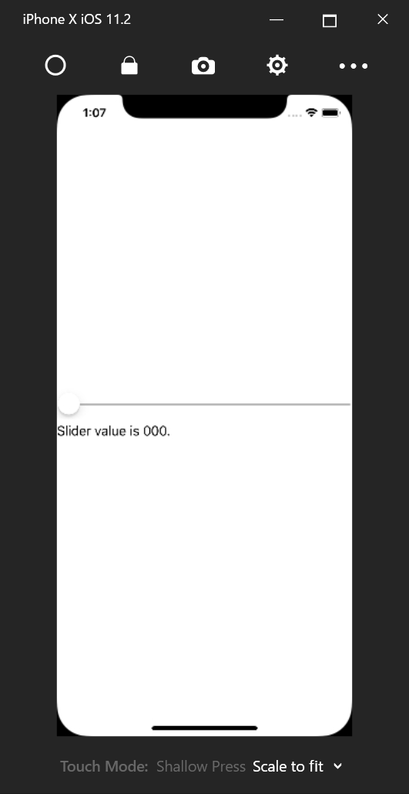
