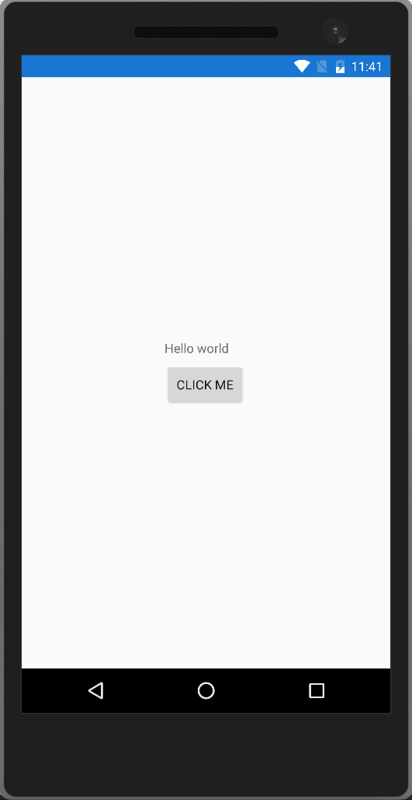

# XAML と C# のコードの対比

XAML はオブジェクトのインスタンスを組み立てるための言語です。
オブジェクトのインスタンスを組み立てるだけなら C# でも可能です。
実際に XAML を使わずに C# で画面部品を組み立てた Xamarin.Forms のサンプルプログラムやリリースされているプログラムもあります。
本書では C# による画面構築は基本的に行わずに XAML を主体とした画面構築を行います。それでは XAML を見て行ってみましょう。

## XAML の基本

XAML は Xamarin.Forms のページを作成するのに使われます。では、ページを作成してみましょう。IDE によって若干生成されるページのコードは異なりますがおおむね以下のようになります。

```xml
<?xml version="1.0" encoding="UTF-8"?>
<ContentPage xmlns="http://xamarin.com/schemas/2014/forms" 
    xmlns:x="http://schemas.microsoft.com/winfx/2009/xaml"  
    x:Class="HelloWorld.MyPage">
</ContentPage>
```

XAML ではタグ名がクラス名に該当します。つまり、これは ContentPage クラスのインスタンスを組み立てているということになります。いくつか XML 名前空間が定義されています。`http://xamarin.com/schemas/2014/forms` 名前空間は Xamarin.Forms のクラスが定義されている特別な名前空間です。
`x`名前空間の `http://schemas.microsoft.com/winfx/2009/xaml` も XAML 内で使用する様々なクラスが定義された名前空間になります。
この 2 つの名前空間は新規作成するとデフォルトで付いてくるものなので自分で打つ必要はありませんが特別なものだと覚えておきましょう。`x:Class`属性はコードビハインドと XAML ファイルを紐づけるためのタグになります。
コードビハインドクラスは HelloWorld.MyPage クラスであるということが定義されています。

XAML では XML の属性が C# のプロパティの設定に該当します。
ContentPage クラスには string 型の Title プロパティがあるので、それに Hello world を設定すると XAML は以下のようになります。

```xml
<?xml version="1.0" encoding="UTF-8"?>
<ContentPage xmlns="http://xamarin.com/schemas/2014/forms"
    xmlns:x="http://schemas.microsoft.com/winfx/2009/xaml"
    x:Class="HelloWorld.MyPage"
    Title="Hello world">
</ContentPage>
```

C# のコードで表すと以下のようなイメージになります。

```cs
var page = new ContentPage
{
    Title = “Hello world”,
};
```

ContentPage にコントロールを配置するには object 型の Content プロパティにコントロールを配置していきます。
各種コントロールのような複雑なオブジェクトをプロパティに設定するための構文として、プロパティ要素構文というものがあります。これは、タグ名としてプロパティを定義するための構文で、「クラス名.プロパティ名」という形でタグを書くことで、タグとしてプロパティを設定できます。こうすることでオブジェクトのような複雑な型をプロパティに設定することができます。例えば ContentPage に Hello world と設定した Label （テキストを表示するためのコントロール）を設定した XAML を以下に示します。

```xml
<?xml version="1.0" encoding="UTF-8"?>
<ContentPage xmlns="http://xamarin.com/schemas/2014/forms"
    xmlns:x="http://schemas.microsoft.com/winfx/2009/xaml"
    x:Class="HelloWorld.MyPage"
    Title="Hello world">
    <ContentPage.Content>
        <Label Text="Hello world" />
    </ContentPage.Content>
</ContentPage>
```

XAML では 1 つのクラスに対して 1 つのコンテンツ プロパティを定義することができます。コンテンツ プロパティは XAML でタグを省略した時に設定されるデフォルトのプロパティのことです。ややこしいのですが ContentPage コントロールは Content プロパティがコンテンツ プロパティとして定義されています。そのため ContentPage.Content のタグは省略できるため上記の XAML は以下のように書くことができます。


```xml
<?xml version="1.0" encoding="UTF-8"?>
<ContentPage xmlns="http://xamarin.com/schemas/2014/forms"
    xmlns:x="http://schemas.microsoft.com/winfx/2009/xaml"
    x:Class="HelloWorld.MyPage"
    Title="Hello world">
    <Label Text="Hello world" />
</ContentPage>
```

複数のコントロールをページに置いてみましょう。
ContentPage クラスの Content プロパティは単一の要素しか置けないため、複数のコントロールを配置するときは要素のレイアウトを行うコントロールを置いて、その中にコントロールを配置して行います。よく使われるレイアウト コントロールとして StackLayout というクラスがあります。これは子要素を縦や横に並べるコントロールです。StackLayout コントロールには Children プロパティというコレクション型のプロパティがあり、そこにコントロールを追加していきます。

コレクション型のプロパティに対して要素を追加するにはコレクション構文というものがあり、コレクションのプロパティに対して直接子要素を設定することでコレクションに設定させることができます。そのため StackLayout に対して Label コントロールと Button コントロールを配置するには以下のように書くことができます。

また、水平方向と垂直方向に中央に表示させるための HorizontalOptions プロパティと VerticalOpeions プロパティの設定もあわせて行っています。


```xml
<?xml version="1.0" encoding="UTF-8"?>
<ContentPage xmlns="http://xamarin.com/schemas/2014/forms"
             xmlns:x="http://schemas.microsoft.com/winfx/2009/xaml"
             x:Class="HelloWorld.MyPage"
             Title="Hello world">
    <StackLayout HorizontalOptions="Center"
                 VerticalOptions="Center">
        <Label x:Name="labelHelloWorld"
               Text="Hello world" />
        <Button Text="Click me" />
    </StackLayout>
</ContentPage>
</ContentPage>
```

次にイベントを設定する方法を示します。各コントロールには様々なユーザーの操作に対応するためのイベントが定義されています。代表的なものとして Button コントロールの Clicked イベントがあります。名前の通り Button がタップされたときに起きるイベントです。イベントはプロパティの設定と同じように「イベント名=”イベントハンドラ名”」という形式で記述します。イベントハンドラは各種イベントに応じた引数を受け取るメソッドで、コードビハインド クラスに定義されます。では上記の XAML に対して Button の Clicked イベントに OnClicked イベントを割り当ててみましょう。
XAML を以下に示します。

```xml
<?xml version="1.0" encoding="UTF-8"?>
<ContentPage xmlns="http://xamarin.com/schemas/2014/forms"
             xmlns:x="http://schemas.microsoft.com/winfx/2009/xaml"
             x:Class="HelloWorld.MyPage"
             Title="Hello world">
    <StackLayout HorizontalOptions="Center"
                 VerticalOptions="Center">
        <Label x:Name="labelHelloWorld"
               Text="Hello world" />
        <Button Text="Click me"
                Clicked="OnClicked" />
    </StackLayout>
</ContentPage>
```

コードビハインドで OnClicked というメソッドを定義します。以下にコードを示します。

```cs
using System;
using Xamarin.Forms;

namespace HelloWorld
{
    public partial class MyPage : ContentPage
    {
        public MyPage()
        {
            InitializeComponent();
        }

        private void OnClicked(object sender, EventArgs args)
        {
            // ここに処理を書く
        }
    }
}
```

コードビハインドからコントロールを触るには x:Name という属性を使用します。`x`名前空間には特殊な動きをする様々な属性や要素が定義されています。詳細はリファレンスをみてください。本サイトでは代表的なものについて適時説明していきます。

> x名前空間で定義されているもののリストのあるページ
> https://developer.xamarin.com/guides/xamarin-forms/xaml/namespaces/

では Label に x:Name 属性で名前をつけて Button がタップされた時に Text プロパティを書き換えるようにしてみたいと思います。まず XAML で Label に `x:Name=”labelHelloWorld”` という形で名前をつけます。

```xml
<Label x:Name="labelHelloWorld"
    Text="Hello world" />
```

そして、先ほどコードビハインドに定義した OnClicked イベント ハンドラに以下のように処理を記述します。

```cs
private void OnClicked(object sender, EventArgs args)
{
    this.labelHelloWorld.Text = "こんにちは世界";
}
```

この状態で実行すると以下のように Button を押すと Label の Text が書き換わります。
Button の選択前は Hello world と表示されていますが Button を選択すると こんにちは世界 に Label の Text が書き換わります。




以上が、XAMLを使用してアプリケーションを組む場合に必要最低限必要な部分になります。
