# 一般的なコントロール

Xamarin.Forms で使用可能な一般的なコントロールについて説明します。

## Label

Label は文字列を表示するためのコントロールです。Text プロパティで表示文字列を指定できます。その他に以下のプロパティでテキストの書式を指定できます。Label 以外の Text を表示するコントロールも同名のプロパティを持っていることが多いため、ここで詳細に説明します。

FontAttributes プロパティは Bold、Italic、None が指定できます。太字でイタリックな書式を指定するには Bold,Italic のようにカンマ区切りで指定します。XAML の例を以下に示します。

```xml
<?xml version="1.0" encoding="UTF-8"?>
<ContentPage xmlns="http://xamarin.com/schemas/2014/forms"
             xmlns:x="http://schemas.microsoft.com/winfx/2009/xaml"
             xmlns:local="clr-namespace:HelloWorld"
             xmlns:ios="clr-namespace:Xamarin.Forms.PlatformConfiguration.iOSSpecific;assembly=Xamarin.Forms.Core"
             ios:Page.UseSafeArea="true"
             x:Class="HelloWorld.MyPage">
    <StackLayout HorizontalOptions="Center"
                 VerticalOptions="Center">
        <Label Text="Hello world" />
        <Label Text="Hello world Bold"
               FontAttributes="Bold" />
        <Label Text="Hello world Italic"
               FontAttributes="Italic" />
        <Label Text="Hello world Bold,Italic"
               FontAttributes="Bold,Italic" />
    </StackLayout>
</ContentPage>
```

実行結果を以下に示します。

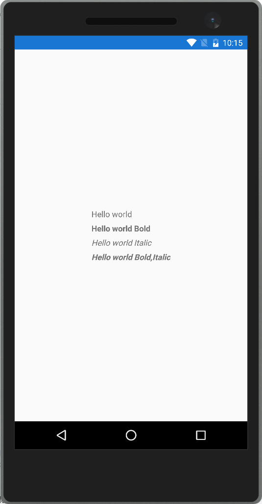

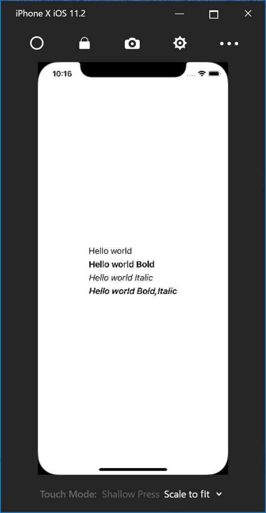

FontFamily プロパティでフォント名を指定します。sans-serif と monospace などが指定できます。FontSize でフォントのサイズが指定できます。デバイス非依存のピクセルサイズの他に名前でサイズを指定可能です。サイズの名前は Default, Large, Medium, Small, Micro が指定可能です。XAML の例を以下に示します。

```xml
<?xml version="1.0" encoding="UTF-8"?>
<ContentPage xmlns="http://xamarin.com/schemas/2014/forms"
             xmlns:x="http://schemas.microsoft.com/winfx/2009/xaml"
             xmlns:local="clr-namespace:HelloWorld"
             xmlns:ios="clr-namespace:Xamarin.Forms.PlatformConfiguration.iOSSpecific;assembly=Xamarin.Forms.Core"
             ios:Page.UseSafeArea="true"
             x:Class="HelloWorld.MyPage">
    <StackLayout HorizontalOptions="Center"
                 VerticalOptions="Center">
        <Label Text="Hello world Default."
               FontSize="Default" />
        <Label Text="Hello world Large."
               FontSize="Large" />
        <Label Text="Hello world Medium."
               FontSize="Medium" />
        <Label Text="Hello world Small."
               FontSize="Small" />
        <Label Text="Hello world Micro."
               FontSize="Micro" />
        <Label Text="Hello world Number."
               FontSize="24" />
    </StackLayout>
</ContentPage>
```

実行結果を以下に示します。

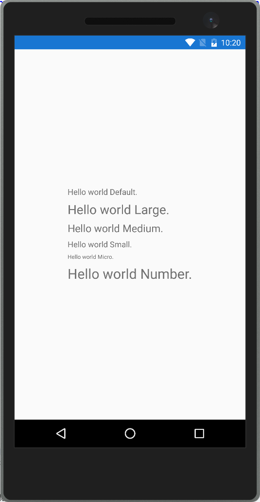

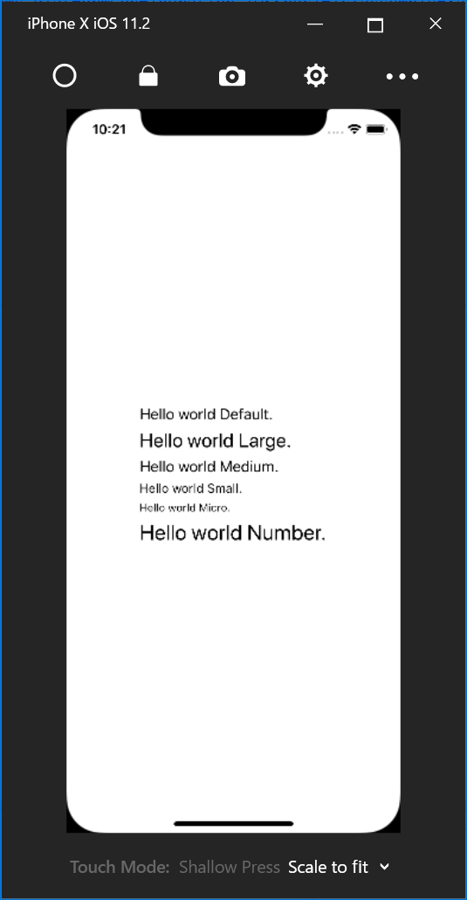

LineBreakMode プロパティで折り返し方法などが指定できます。設定できる値は CharacterWrap, HeadTruncation, MiddleTruncation, NoWrap, TailTruncation, WordWrap になります。Wrap とつくものが横幅に収まりきらないときに折り返しを行う設定で Truncation とつくものが…でトランケートする設定になります。XAML を以下に示します。

```xml
<?xml version="1.0" encoding="UTF-8"?>
<ContentPage xmlns="http://xamarin.com/schemas/2014/forms"
             xmlns:x="http://schemas.microsoft.com/winfx/2009/xaml"
             xmlns:local="clr-namespace:HelloWorld"
             xmlns:ios="clr-namespace:Xamarin.Forms.PlatformConfiguration.iOSSpecific;assembly=Xamarin.Forms.Core"
             ios:Page.UseSafeArea="true"
             x:Class="HelloWorld.MyPage">
    <StackLayout HorizontalOptions="Center"
                 VerticalOptions="Center">
        <Frame WidthRequest="75">
            <Label Text="This is a long long long long long long long long long text!!!!!!"
                   LineBreakMode="CharacterWrap" />
        </Frame>
        <Frame WidthRequest="75">
            <Label Text="This is a long long long long long long long long long text!!!!!!"
                   LineBreakMode="TailTruncation" />
        </Frame>
    </StackLayout>
</ContentPage>
```

最初の Label は文字単位での折り返しを指定しています。2 つ目の Label は末尾でトランケートを指定しています。実行結果を以下に示します。

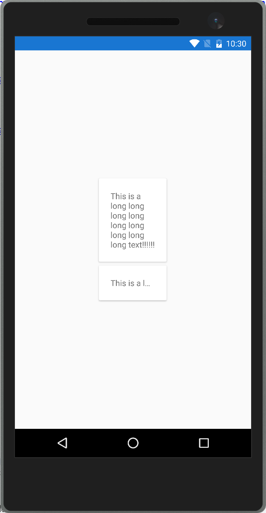

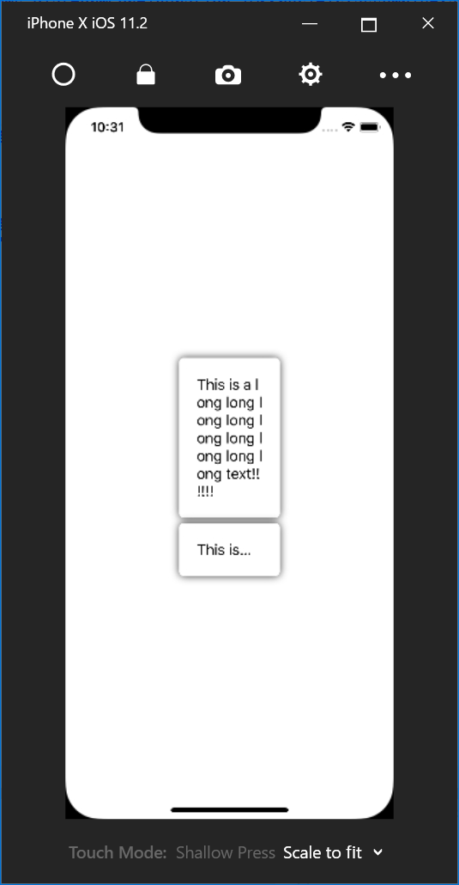

TextColor プロパティを指定することでテキストの色の指定が可能です。以下に XAML を示します。

```xml
<?xml version="1.0" encoding="UTF-8"?>
<ContentPage xmlns="http://xamarin.com/schemas/2014/forms"
             xmlns:x="http://schemas.microsoft.com/winfx/2009/xaml"
             xmlns:local="clr-namespace:HelloWorld"
             xmlns:ios="clr-namespace:Xamarin.Forms.PlatformConfiguration.iOSSpecific;assembly=Xamarin.Forms.Core"
             ios:Page.UseSafeArea="true"
             x:Class="HelloWorld.MyPage">
    <StackLayout HorizontalOptions="Center"
                 VerticalOptions="Center">
        <Label Text="Red"
               TextColor="Red" />
        <Label Text="Blue"
               TextColor="Blue" />
        <Label Text="Yellow"
               TextColor="Yellow" />
    </StackLayout>
</ContentPage>
```

実行結果を以下に示します。

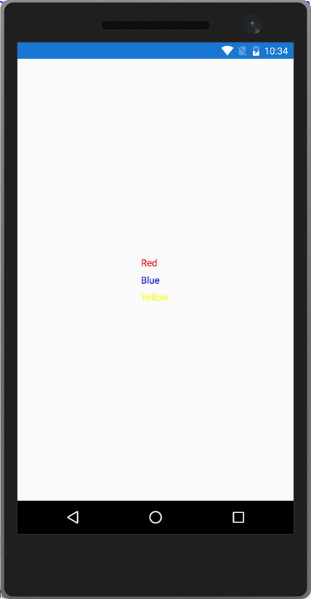

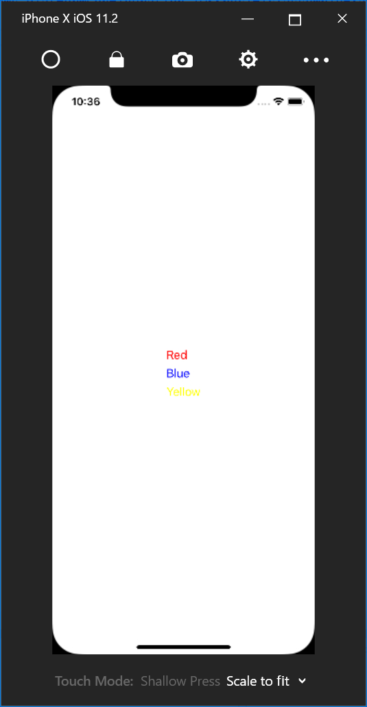

HorizontalTextAlign と VerticalTextAlign で水平方向、垂直方向のテキストの位置を指定できます。指定できる値は Start, End, Center になります。XAML の例を以下に示します。

```xml
<?xml version="1.0" encoding="UTF-8"?>
<ContentPage xmlns="http://xamarin.com/schemas/2014/forms"
             xmlns:x="http://schemas.microsoft.com/winfx/2009/xaml"
             xmlns:local="clr-namespace:HelloWorld"
             xmlns:ios="clr-namespace:Xamarin.Forms.PlatformConfiguration.iOSSpecific;assembly=Xamarin.Forms.Core"
             ios:Page.UseSafeArea="true"
             x:Class="HelloWorld.MyPage">
    <StackLayout HorizontalOptions="Center"
                 VerticalOptions="Center">
        <Frame WidthRequest="100"
               HeightRequest="100">
            <Label Text="Start"
                   HorizontalTextAlignment="Start"
                   VerticalTextAlignment="Start" />
        </Frame>
        <Frame WidthRequest="100"
               HeightRequest="100">
            <Label Text="Center"
                   HorizontalTextAlignment="Center"
                   VerticalTextAlignment="Center" />
        </Frame>
        <Frame WidthRequest="100"
               HeightRequest="100">
            <Label Text="End"
                   HorizontalTextAlignment="End"
                   VerticalTextAlignment="End" />
        </Frame>
    </StackLayout>
</ContentPage>
```

実行結果を以下に示します。

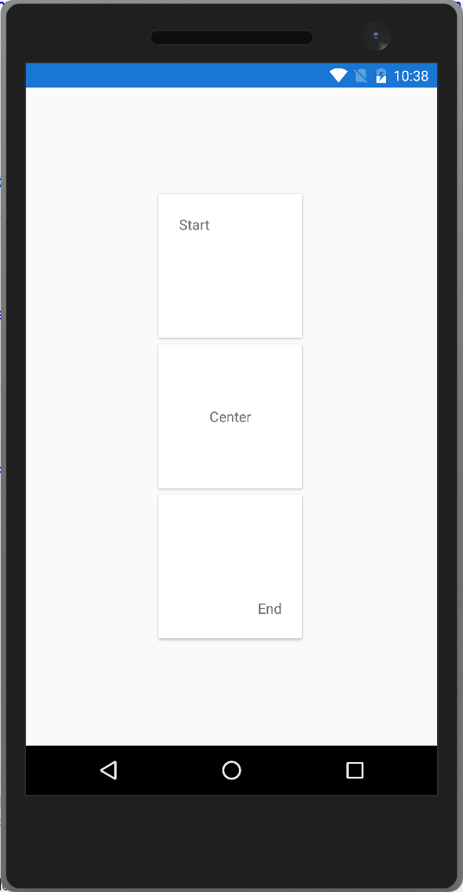

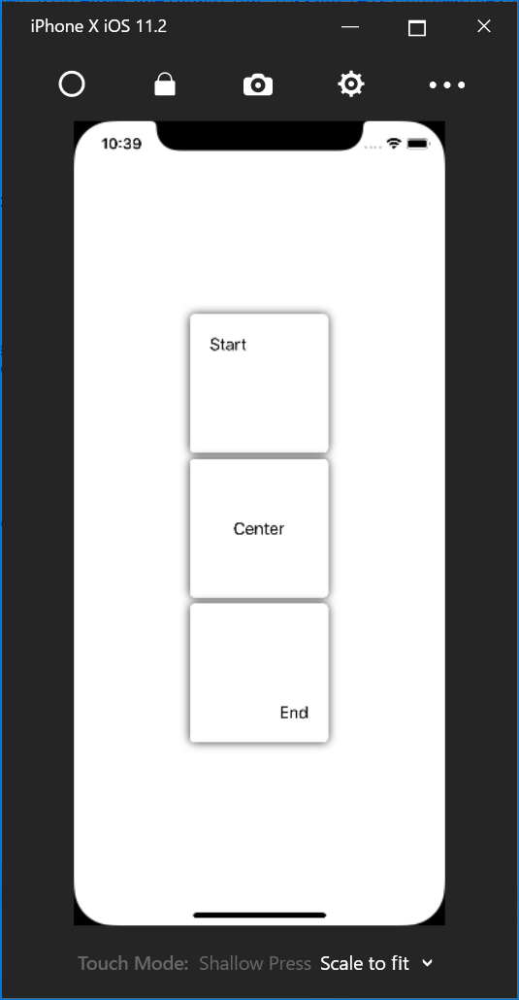

最後に FormattedText プロパティについて説明します。FormattedText プロパティは名前の通り書式付きのテキストを指定することができます。FormattedString 型を指定します。FormattedString 型の Spans プロパティに Span のコレクションを指定して書式付きテキストを表現します。Span 型は BackgorundColor, FontAttributes, FontFamily, FontSize, ForegroundColor, Text プロパティがあり、それぞれ名前の通り背景色やフォントの属性などが指定できます。FormattedText を使用した XAML の例を以下に示します。

```xml
<?xml version="1.0" encoding="UTF-8"?>
<ContentPage xmlns="http://xamarin.com/schemas/2014/forms"
             xmlns:x="http://schemas.microsoft.com/winfx/2009/xaml"
             xmlns:local="clr-namespace:HelloWorld"
             xmlns:ios="clr-namespace:Xamarin.Forms.PlatformConfiguration.iOSSpecific;assembly=Xamarin.Forms.Core"
             ios:Page.UseSafeArea="true"
             x:Class="HelloWorld.MyPage">
    <StackLayout HorizontalOptions="Center"
                 VerticalOptions="Center">
        <Label>
            <Label.FormattedText>
                <FormattedString>
                    <Span Text="H"
                          FontAttributes="Bold"
                          ForegroundColor="Red" />
                    <Span Text="e"
                          BackgroundColor="Silver" />
                    <Span Text="l"
                          FontAttributes="Bold,Italic"
                          FontSize="Small" />
                    <Span Text="l"
                          ForegroundColor="Aqua"
                          FontSize="Large" />
                    <Span Text="o" />
                </FormattedString>
            </Label.FormattedText>
        </Label>
    </StackLayout>
</ContentPage>
```

実行結果を以下に示します。

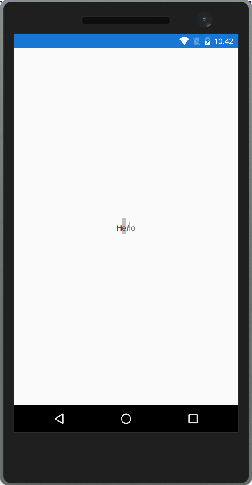

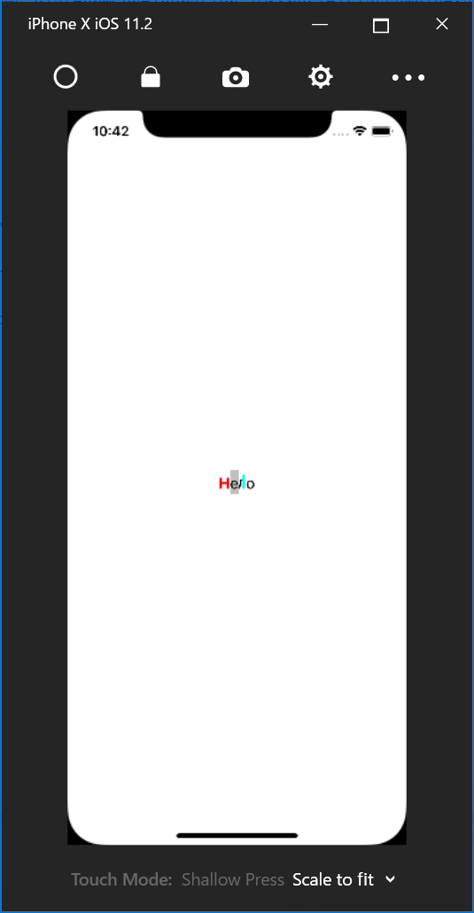

## ActivityIndicator

処理中を表すインジケータのコントロールです。Color プロパティでインジケータの色を指定して IsRunning プロパティでインジケータの表示・非表示を制御します。

以下に XAML の例を示します。

```xml
<?xml version="1.0" encoding="UTF-8"?>
<ContentPage xmlns="http://xamarin.com/schemas/2014/forms"
             xmlns:x="http://schemas.microsoft.com/winfx/2009/xaml"
             xmlns:local="clr-namespace:HelloWorld"
             xmlns:ios="clr-namespace:Xamarin.Forms.PlatformConfiguration.iOSSpecific;assembly=Xamarin.Forms.Core"
             ios:Page.UseSafeArea="true"
             x:Class="HelloWorld.MyPage">
    <StackLayout>
        <ActivityIndicator Color="Red"
                           HorizontalOptions="Center"
                           VerticalOptions="CenterAndExpand"
                           IsRunning="true" />
    </StackLayout>
</ContentPage>
```

実行結果を以下に示します。


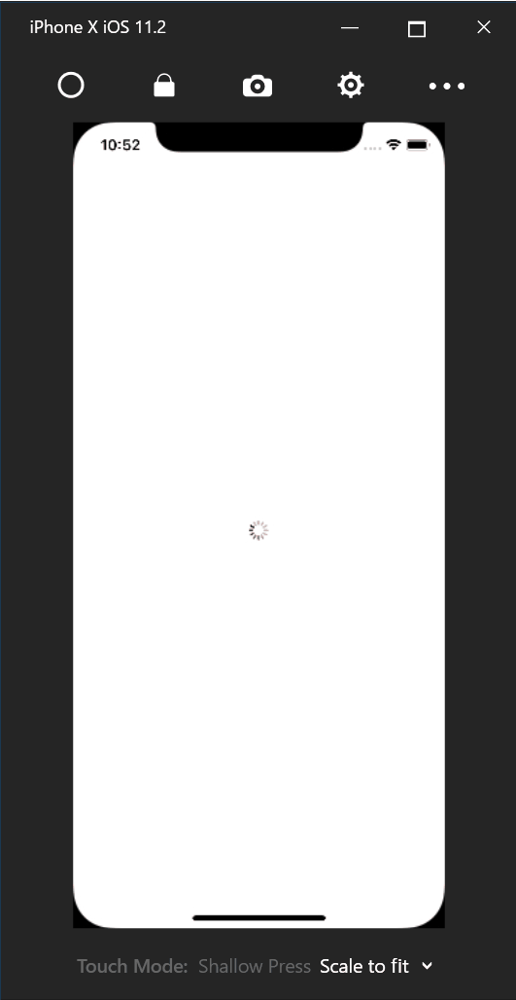

実際に使う場合は IsVisible プロパティ(bool 型)で表示・非表示を切り替えて使うと非表示時に他の UI 操作の邪魔をしないため良いと思います。

## BoxView

BoxView は矩形を表示するためのコントロールです。Color プロパティで色を指定できます。以下に XAML を示します。

```xml
<?xml version="1.0" encoding="UTF-8"?>
<ContentPage xmlns="http://xamarin.com/schemas/2014/forms"
             xmlns:x="http://schemas.microsoft.com/winfx/2009/xaml"
             xmlns:local="clr-namespace:HelloWorld"
             xmlns:ios="clr-namespace:Xamarin.Forms.PlatformConfiguration.iOSSpecific;assembly=Xamarin.Forms.Core"
             ios:Page.UseSafeArea="true"
             x:Class="HelloWorld.MyPage">
    <StackLayout HorizontalOptions="Center"
                 VerticalOptions="Center">
        <BoxView Color="Red"
                 WidthRequest="50"
                 HeightRequest="50" />
    </StackLayout>
</ContentPage>
```

実行結果を以下に示します。

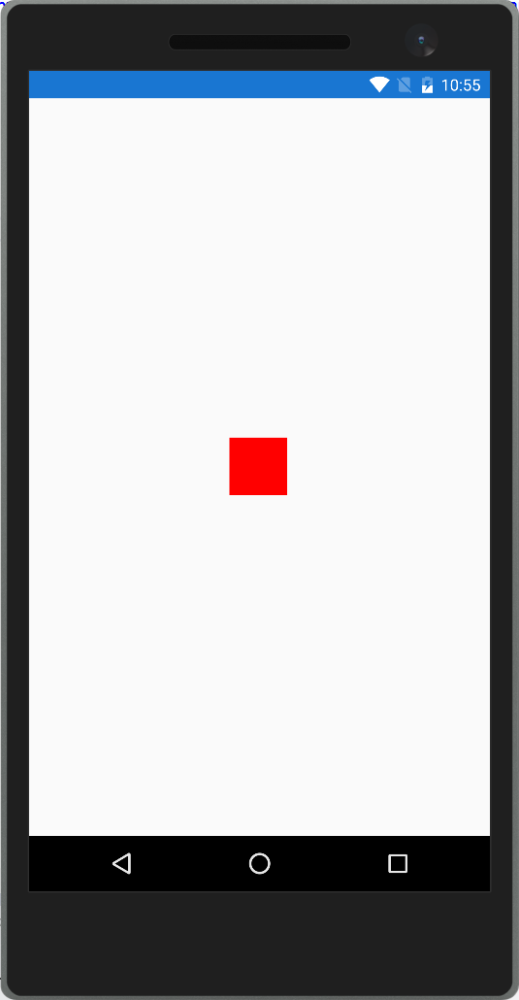

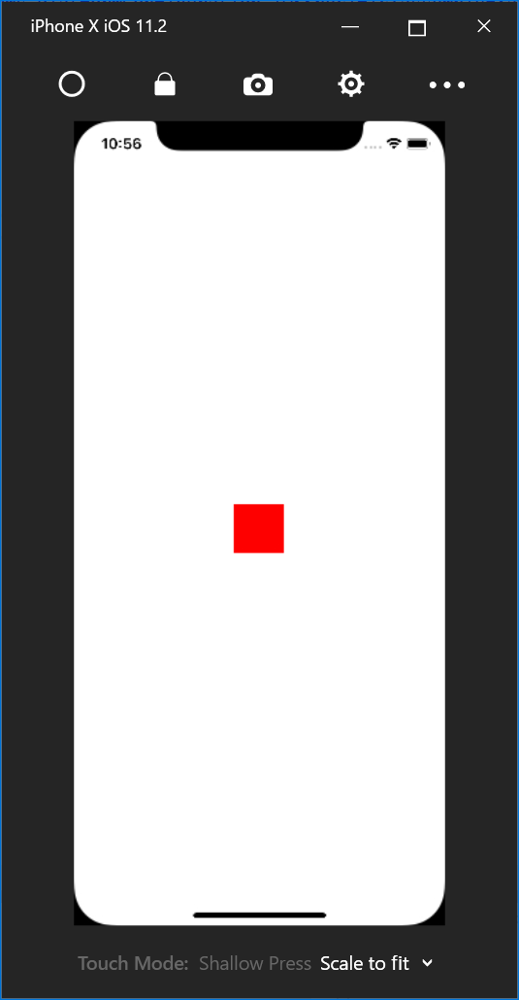

## Button

Button はタップ可能な領域を提供するコントロールです。一般的にユーザーがアクションを起こすときのきっかけとして使用されます。Button には Label で説明したのと同様に FontAttributes, FintFamily, FintSize, TextColor プロパティでテキストの書式を指定できます。これに加えて BorderColor で枠線の色、BorderRadius で枠線の角の丸まり具合、BorderWidth で枠線の幅を指定できます。

XAML の例を以下に示します。

```xml
<?xml version="1.0" encoding="UTF-8"?>
<ContentPage xmlns="http://xamarin.com/schemas/2014/forms"
             xmlns:x="http://schemas.microsoft.com/winfx/2009/xaml"
             xmlns:local="clr-namespace:HelloWorld"
             xmlns:ios="clr-namespace:Xamarin.Forms.PlatformConfiguration.iOSSpecific;assembly=Xamarin.Forms.Core"
             ios:Page.UseSafeArea="true"
             x:Class="HelloWorld.MyPage">
    <StackLayout HorizontalOptions="Center"
                 VerticalOptions="Center">
        <Button Text="Default" />
        <Button Text="Border"
                BorderColor="Olive"
                BorderRadius="30"
                BorderWidth="2"
                WidthRequest="60"
                HeightRequest="60"
                BackgroundColor="Teal"
                TextColor="White" />
    </StackLayout>
</ContentPage>
```

実行結果を以下に示します。

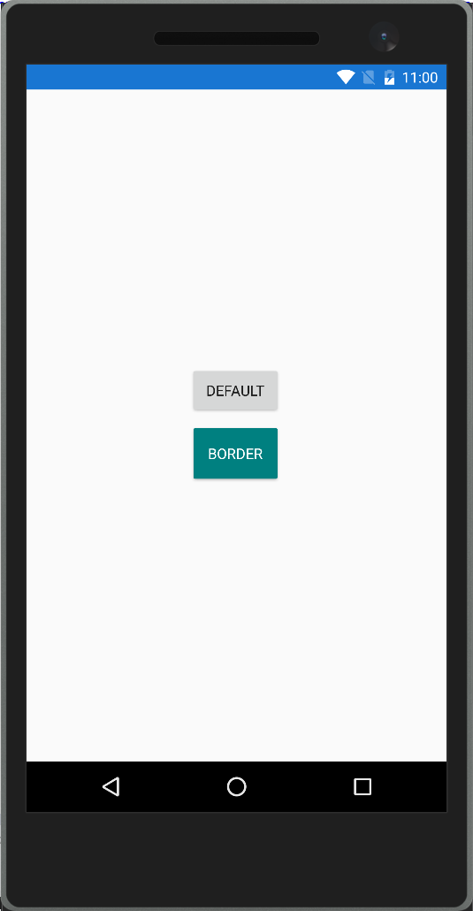

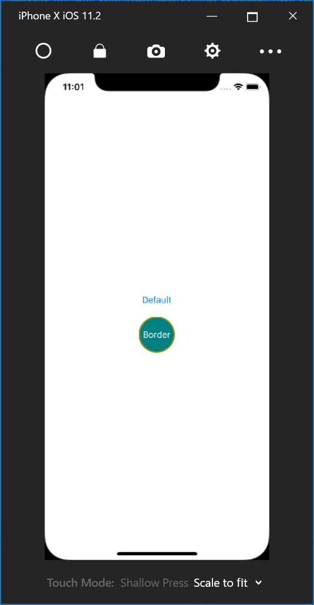

Android では Border 系のプロパティが効いていないことが確認できます。このような見た目の差異があることに注意して Border 系プロパティは指定しましょう。

Button コントロールは Clicked イベントを購読することでボタンがタップされた時の処理を記述できます。コード例を以下に示します。

```xml
<?xml version="1.0" encoding="UTF-8"?>
<ContentPage xmlns="http://xamarin.com/schemas/2014/forms"
             xmlns:x="http://schemas.microsoft.com/winfx/2009/xaml"
             xmlns:local="clr-namespace:HelloWorld"
             xmlns:ios="clr-namespace:Xamarin.Forms.PlatformConfiguration.iOSSpecific;assembly=Xamarin.Forms.Core"
             ios:Page.UseSafeArea="true"
             x:Class="HelloWorld.MyPage">
    <StackLayout HorizontalOptions="Center"
                 VerticalOptions="Center">
        <Label x:Name="label" />
        <Button Text="Default"
                Clicked="ButtonLabelChange_Clicked" />
    </StackLayout>
</ContentPage>
```

コードビハインドにイベントハンドラを記述します。コードを以下に示します。

```cs
using System;
using Xamarin.Forms;

namespace HelloWorld
{
    public partial class MyPage : ContentPage
    {
        public MyPage()
        {
            InitializeComponent();
        }

        private void ButtonLabelChange_Clicked(object sender, EventArgs e)
        {
            this.label.Text = DateTime.Now.ToString();
        }
    }
}
```

実行してボタンをタップした結果を以下に示します。


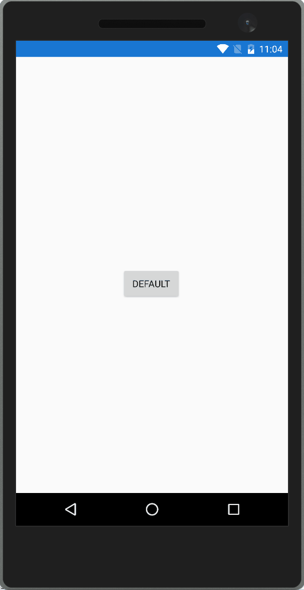


Button コントロールにはユーザーからの操作を受け取る方法としてイベントの他に Command というものが提供されています。これはデータ バインディングと共に使用されることが多いプロパティです。Command プロパティは、ICommand インターフェース型で実行を行う Execute メソッドと、実行可否を返す CanExecute メソッドと、実行可否のステータスが変わったことを示す CanExecuteChanged イベントが定義されています。Xamarin.Forms ではデフォルトの ICommand インターフェースの実装クラスとして Command クラスを提供しています。このクラスはデリゲートで Execute と CanExecute の指定が可能になっています。使用例を以下に示します。

まず BindingContext に設定するための以下のようなクラスを用意します。このクラスに Command をもたせています。Command では Execute 時に Message プロパティを更新するようにしています。

```cs
using System;
using Xamarin.Forms;

namespace HelloWorld
{
    public class MyPageViewModel : BindableBase
    {
        private string _message;

        public string Message
        {
            get => _message;
            set => SetProperty(ref _message, value);
        }

        public Command NowCommand { get; }

        public MyPageViewModel()
        {
            this.NowCommand = new Command(_ => Message = DateTime.Now.ToString());
        }
    }
}
```

XAML で上記クラスを BindingContext に設定してデータバインディングしています。

```xml
<?xml version="1.0" encoding="UTF-8"?>
<ContentPage xmlns="http://xamarin.com/schemas/2014/forms"
             xmlns:x="http://schemas.microsoft.com/winfx/2009/xaml"
             xmlns:local="clr-namespace:HelloWorld"
             xmlns:ios="clr-namespace:Xamarin.Forms.PlatformConfiguration.iOSSpecific;assembly=Xamarin.Forms.Core"
             ios:Page.UseSafeArea="true"
             x:Class="HelloWorld.MyPage">
    <ContentPage.BindingContext>
        <local:MyPageViewModel />
    </ContentPage.BindingContext>
    <StackLayout HorizontalOptions="Center"
                 VerticalOptions="Center">
        <Label Text="{Binding Message}" />
        <Button Text="Default"
                Command="{Binding NowCommand}" />
    </StackLayout>
</ContentPage>
```

実行してボタンをタップした結果を以下に示します。

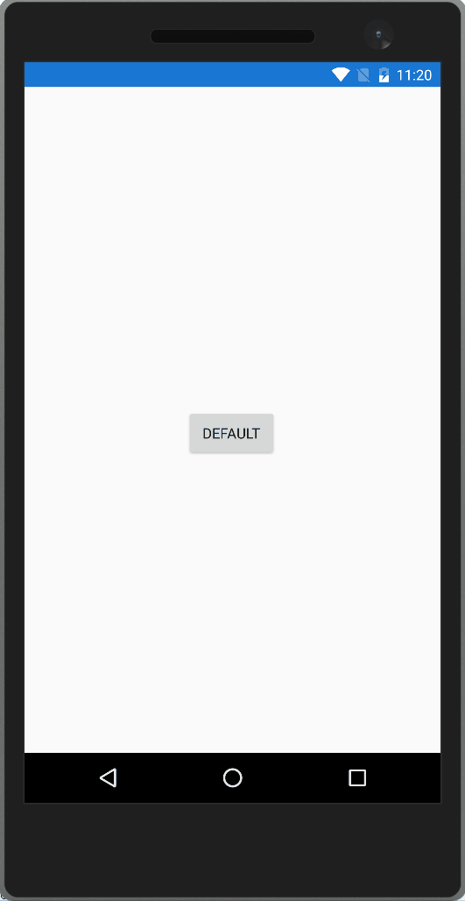

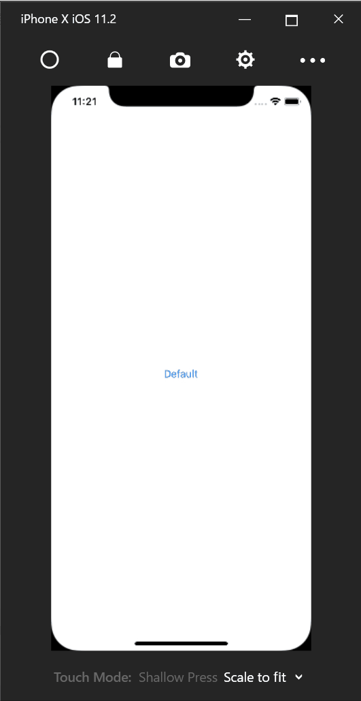

これに実行可否の機能を追加したいと思います。実行可否の状態を保持するための CanExecute という名前のプロパティを MyPageViewModel クラスに定義します。そして Command の CanExecute の処理で、その値を返します。CanExecute プロパティの変更のタイミングで NowCommand の実行可否状態に変化があったことを通知するために ChangeCanExecute メソッドを呼び出しています。コードを以下に示します。

```cs
using System;
using Xamarin.Forms;

namespace HelloWorld
{
    public class MyPageViewModel : BindableBase
    {
        private string _message;

        public string Message
        {
            get => _message; 
            set => SetProperty(ref _message, value); 
        }

        private bool _canExecute;

        public bool CanExecute
        {
            get => _canExecute;
            set
            {
                SetProperty(ref _canExecute, value);
                NowCommand.ChangeCanExecute();
            }
        }

        public Command NowCommand { get; }

        public MyPageViewModel()
        {
            NowCommand = new Command(
                _ => Message = DateTime.Now.ToString(),
                _ => CanExecute);
        }
    }
}
```

XAML 側では Switch という ON/OFF 状態を表すコントロールを使って MyPageViewModel クラスの CanExecute プロパティの切り替えを行なっています。XAML を以下に示します。

```xml
<?xml version="1.0" encoding="UTF-8"?>
<ContentPage xmlns="http://xamarin.com/schemas/2014/forms"
             xmlns:x="http://schemas.microsoft.com/winfx/2009/xaml"
             xmlns:local="clr-namespace:HelloWorld"
             xmlns:ios="clr-namespace:Xamarin.Forms.PlatformConfiguration.iOSSpecific;assembly=Xamarin.Forms.Core"
             ios:Page.UseSafeArea="true"
             x:Class="HelloWorld.MyPage">
    <ContentPage.BindingContext>
        <local:MyPageViewModel />
    </ContentPage.BindingContext>
    <StackLayout HorizontalOptions="Center"
                 VerticalOptions="Center">
        <Label Text="{Binding Message}" />
        <Button Text="Default"
                Command="{Binding NowCommand}" />
        <Switch IsToggled="{Binding CanExecute, Mode=TwoWay}" />
    </StackLayout>
</ContentPage>
```

実行結果を以下に示します。Switch の状態に連動して Button の実行可否が切り替わっていることが確認できます。

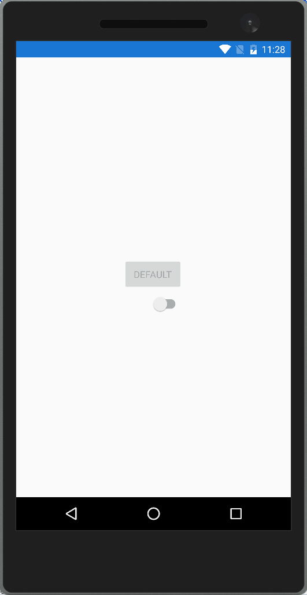

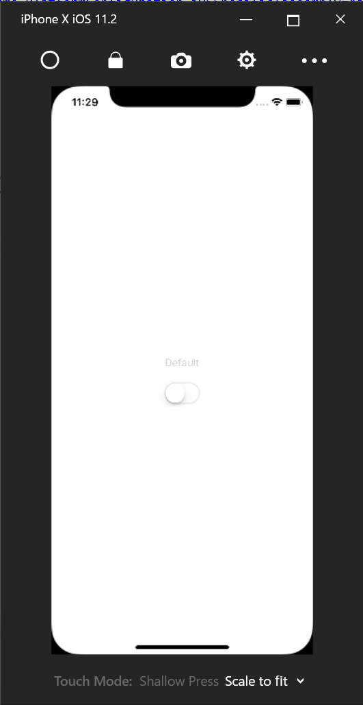

Command にはパラメータを渡すことができます。Button クラスの CommandParameter クラスで指定します。このプロパティを設定すると Command の Execute と CanExecute にパラメータを渡すことができるようになります。日付の書式指定を CommandParameter で渡すようにしたコード例を以下に示します。まず MyPageViewModel を、パラメータを使うように変更します。

```cs
NowCommand = new Command(
    x => Message = DateTime.Now.ToString((string)x),
    _ => CanExecute);
```

そして Button の CommandParameter に以下のように書式文字列を指定するようにします。

```xml
<Button Text="Default"
        Command="{Binding NowCommand}"
        CommandParameter="yyyy/MM/dd" />
```

実行すると CommandParameter で指定した書式になっていることが確認できます。実行結果を以下に示します。


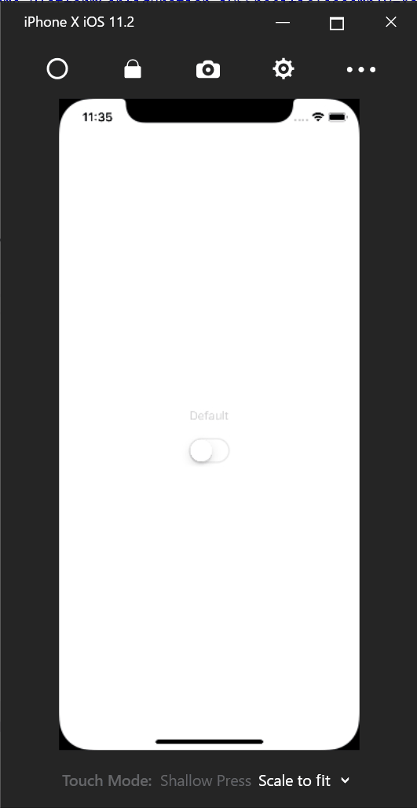

## DatePicker

DatePicker は日付を選択するUIを提供するコントロールです。Date プロパティで選択日付を DateTime 型で取得や設定できます。MaximumDate プロパティ, MinimumDate プロパティで DatePicker で選択可能な日付の範囲を指定できます。Format プロパティで yyyy-MM-dd などのように日付の表示時のフォーマットを指定できます。XAML の例を以下に示します。

```xml
<?xml version="1.0" encoding="UTF-8"?>
<ContentPage xmlns="http://xamarin.com/schemas/2014/forms"
             xmlns:x="http://schemas.microsoft.com/winfx/2009/xaml"
             xmlns:local="clr-namespace:HelloWorld"
             xmlns:sys="clr-namespace:System;assembly=mscorlib"
             xmlns:ios="clr-namespace:Xamarin.Forms.PlatformConfiguration.iOSSpecific;assembly=Xamarin.Forms.Core"
             ios:Page.UseSafeArea="true"
             x:Class="HelloWorld.MyPage">
    <StackLayout HorizontalOptions="Center"
                 VerticalOptions="Center">
        <Label Text="{Binding Date, Source={x:Reference datePicker}, StringFormat='{0:yyyy-MM-dd}'}" />
        <DatePicker x:Name="datePicker"
                    Format="yyyy/MM/dd"
                    VerticalOptions="CenterAndExpand">
            <DatePicker.MaximumDate>
                <sys:DateTime x:FactoryMethod="Parse">
                    <x:Arguments>
                        <sys:String>2050/12/31</sys:String>
                    </x:Arguments>
                </sys:DateTime>
            </DatePicker.MaximumDate>
            <DatePicker.MinimumDate>
                <sys:DateTime x:FactoryMethod="Parse">
                    <x:Arguments>
                        <sys:String>1900/1/1</sys:String>
                    </x:Arguments>
                </sys:DateTime>
            </DatePicker.MinimumDate>
        </DatePicker>
    </StackLayout>
</ContentPage>
```

MaximumDate プロパティと MinimumDate プロパティを指定する箇所で若干 XAML の紹介していない機能を使用しているため説明します。x:FactoryMethod 属性はオブジェクトのインスタンスを生成するときのファクトリメソッドを指定できます。今回の例では DateTime 型の Parse メソッドを使用してインスタンスを指定するという意味になります。そして x:Arguments でファクトリメソッドの引数を指定しています。引数には、それぞれ 2050/12/31 と 1900/1/1 という文字列を渡しています。
つまり上記 XAML で 1900/1/1 から 2050/12/31 までの間の日付が選択可能でフォーマットが yyyy/MM/dd で表示される DatePicker が定義されています。そして選択日付は Label コントロールに yyyy-MM-dd というフォーマットで表示されるように指定しています。実行結果を以下に示します。

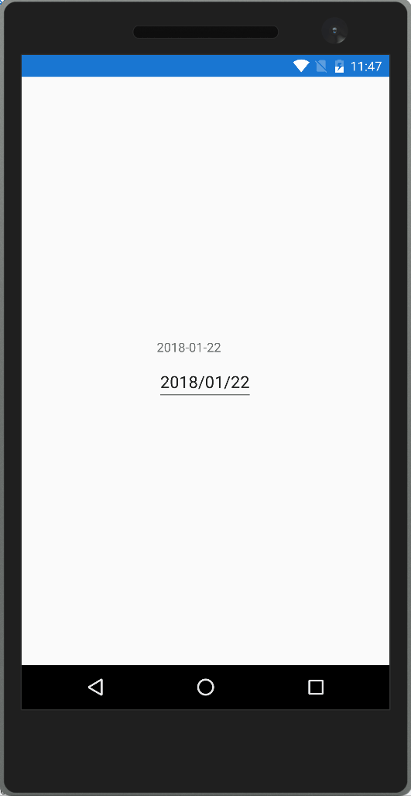

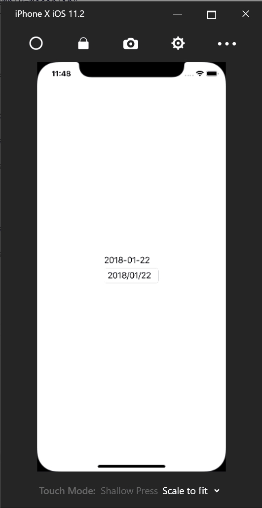
