# レイアウトコントロール

ここでは Xamarin.Forms でレイアウトに関係するコントロールについて紹介します。Xamarin.Forms では、以下のように様々なレイアウトコントロールが提供されています。

- StackLayout
- Grid
- AbsoluteLayout
- RelativeLayout
- ScrollView

## StackLayout

StackLayout は名前の通りスタック状にコントロールを並べて配置するコントロールです。デフォルトでは縦にコントロールを並べますが Orientation プロパティに Horizontal を指定することで横並びに配置することもできます。StackLayout の基本的な使い方の例を以下に示します。

```xml
<?xml version="1.0" encoding="UTF-8"?>
<ContentPage xmlns="http://xamarin.com/schemas/2014/forms"
             xmlns:x="http://schemas.microsoft.com/winfx/2009/xaml"
             xmlns:local="clr-namespace:HelloWorld"
             xmlns:ios="clr-namespace:Xamarin.Forms.PlatformConfiguration.iOSSpecific;assembly=Xamarin.Forms.Core"
             ios:Page.UseSafeArea="true"
             x:Class="HelloWorld.MyPage">
    <StackLayout>
        <BoxView Color="Red" />
        <BoxView Color="Blue" />
        <BoxView Color="Yellow" />
    </StackLayout>
</ContentPage>
```

実行すると、縦に赤、青、黄色の矩形が並んで表示されます。実行結果を以下に示します。

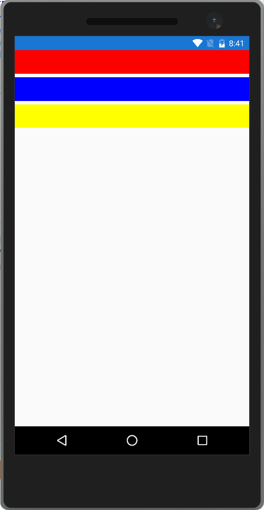

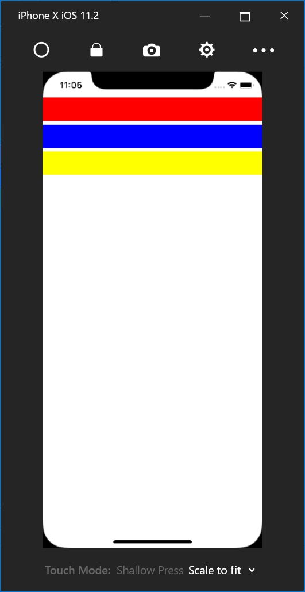

Orientation プロパティを Horizontal(デフォルトは Vertical)に設定することで横並びにすることができます。XAML を以下に示します。

```xml
<?xml version="1.0" encoding="UTF-8"?>
<ContentPage xmlns="http://xamarin.com/schemas/2014/forms"
             xmlns:x="http://schemas.microsoft.com/winfx/2009/xaml"
             xmlns:local="clr-namespace:HelloWorld"
             xmlns:ios="clr-namespace:Xamarin.Forms.PlatformConfiguration.iOSSpecific;assembly=Xamarin.Forms.Core"
             ios:Page.UseSafeArea="true"
             x:Class="HelloWorld.MyPage">
    <StackLayout Orientation="Horizontal">
        <BoxView Color="Red" />
        <BoxView Color="Blue" />
        <BoxView Color="Yellow" />
    </StackLayout>
</ContentPage>
```

実行結果を以下に示します。

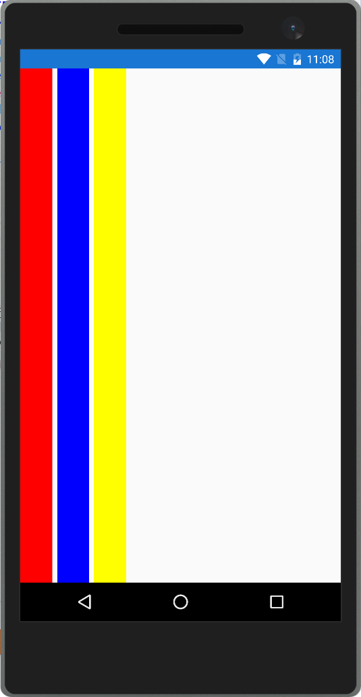

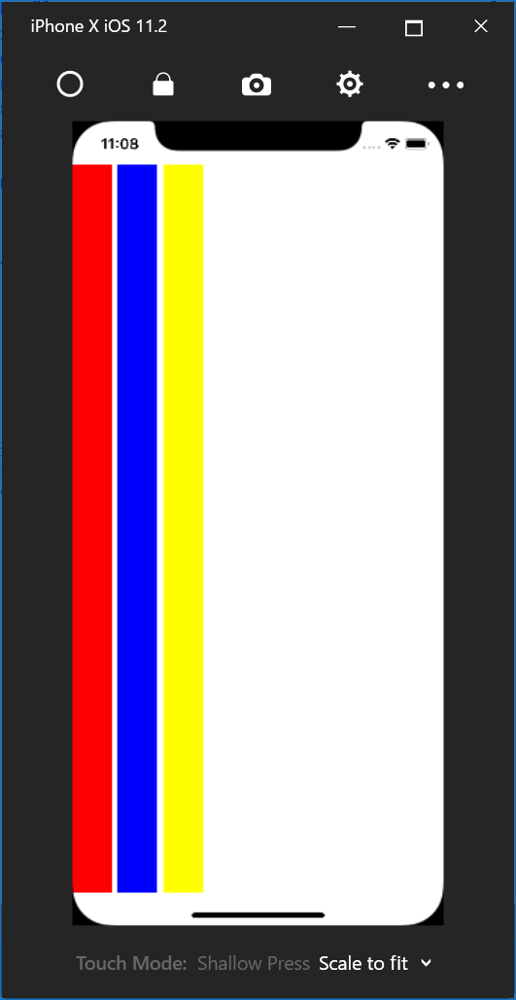

Spacing プロパティに数字を指定すると指定したサイズだけ要素間に空白ができます。XAML の例を以下に示します。

```xml
<?xml version="1.0" encoding="UTF-8"?>
<ContentPage xmlns="http://xamarin.com/schemas/2014/forms"
             xmlns:x="http://schemas.microsoft.com/winfx/2009/xaml"
             xmlns:local="clr-namespace:HelloWorld"
             xmlns:ios="clr-namespace:Xamarin.Forms.PlatformConfiguration.iOSSpecific;assembly=Xamarin.Forms.Core"
             ios:Page.UseSafeArea="true"
             x:Class="HelloWorld.MyPage">
    <StackLayout Spacing="25">
        <BoxView Color="Red" />
        <BoxView Color="Blue" />
        <BoxView Color="Yellow" />
    </StackLayout>
</ContentPage>
```

実行すると以下のようになります。

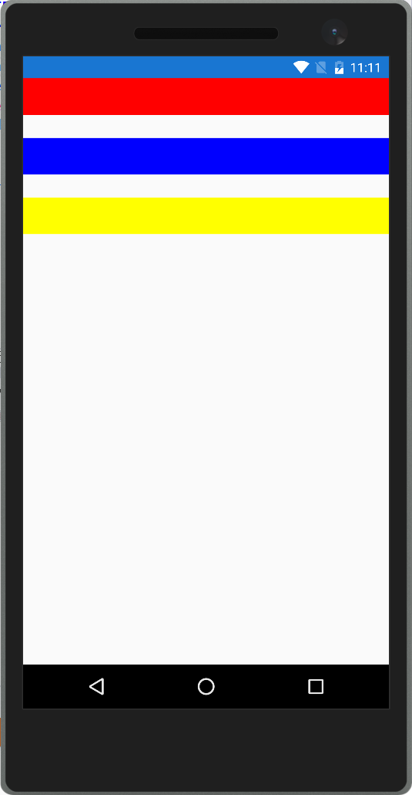

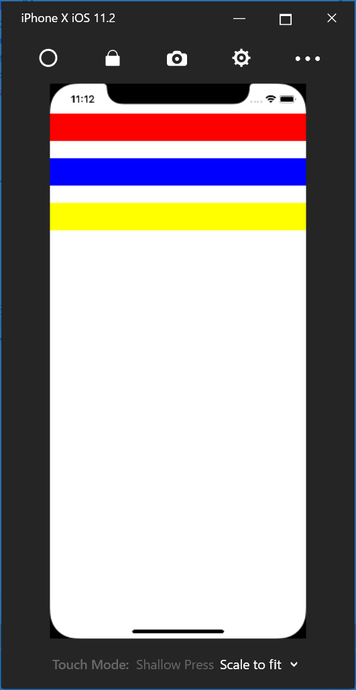

余白があいていることが確認できます。

さらにコントロールの HorizontalOptions プロパティ、VerticalOptions プロパティを使用することで表示位置や表示領域をカスタマイズすることができます。HorizontalOptions プロパティと VerticalOptions プロパティは LayoutOptions 型で以下の値を持ちます。

- Start：開始位置に表示されます。
- Center：中央に表示されます。
- End：終端に表示されます。
- Fill：全体に広がって表示されます。
- StartAndExpand：開始位置に表示され余白を占有します。
- CenterAndExpand：中央に表示され余白を占有します。
- EndAndExpand：終端位置に表示され余白を占有します。
- FillAndExpand：全体に広がって表示され余白を占有します。

動作を確認するための XAML を以下に示します。

```xml
<?xml version="1.0" encoding="UTF-8"?>
<ContentPage xmlns="http://xamarin.com/schemas/2014/forms"
             xmlns:x="http://schemas.microsoft.com/winfx/2009/xaml"
             xmlns:local="clr-namespace:HelloWorld"
             xmlns:ios="clr-namespace:Xamarin.Forms.PlatformConfiguration.iOSSpecific;assembly=Xamarin.Forms.Core"
             ios:Page.UseSafeArea="true"
             x:Class="HelloWorld.MyPage">
    <StackLayout>
        <BoxView Color="Red"
                 HorizontalOptions="Start" />
        <BoxView Color="Blue"
                 HorizontalOptions="Center" />
        <BoxView Color="Yellow"
                 HorizontalOptions="End" />
        <BoxView Color="Silver"
                 HorizontalOptions="Fill" />
    </StackLayout>
</ContentPage>
```

実行結果を以下にしめします。

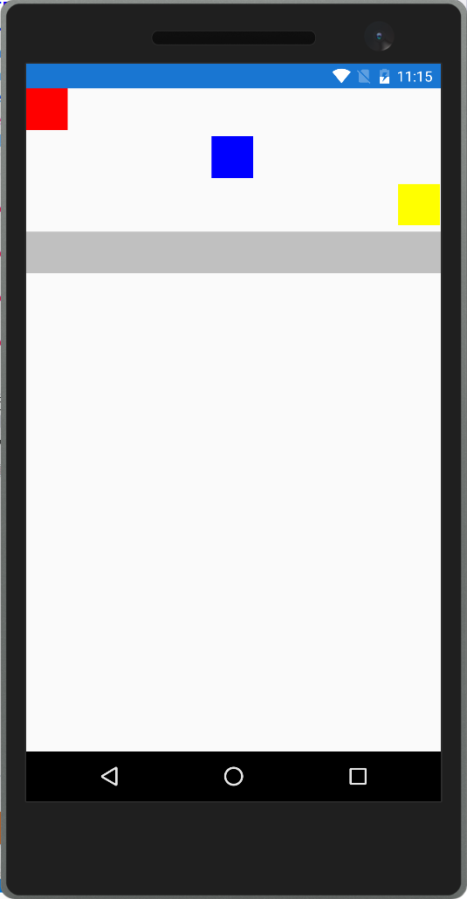

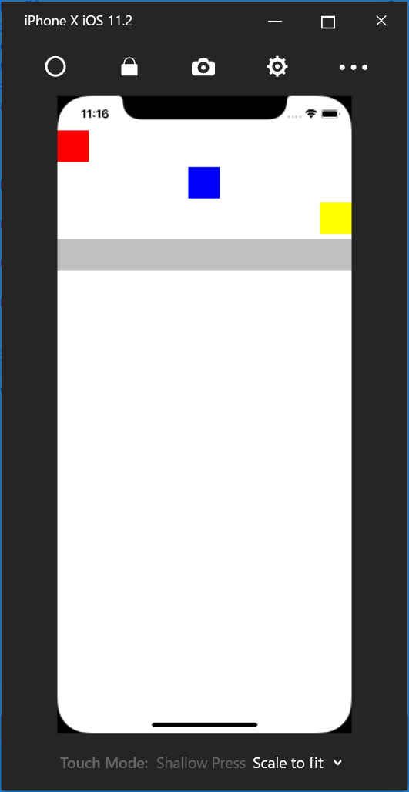

***AndExpand は複数指定されると均等に余白を分割しようとします。そのため以下のように複数指定すると均等にコントロールが配置されます。


```xml
<?xml version="1.0" encoding="UTF-8"?>
<ContentPage xmlns="http://xamarin.com/schemas/2014/forms"
             xmlns:x="http://schemas.microsoft.com/winfx/2009/xaml"
             xmlns:local="clr-namespace:HelloWorld"
             xmlns:ios="clr-namespace:Xamarin.Forms.PlatformConfiguration.iOSSpecific;assembly=Xamarin.Forms.Core"
             ios:Page.UseSafeArea="true"
             x:Class="HelloWorld.MyPage">
    <StackLayout>
        <BoxView Color="Red"
                 VerticalOptions="StartAndExpand" />
        <BoxView Color="Blue"
                 VerticalOptions="CenterAndExpand" />
        <BoxView Color="Yellow"
                 VerticalOptions="EndAndExpand" />
        <BoxView Color="Silver"
                 VerticalOptions="FillAndExpand" />
    </StackLayout>
</ContentPage>
```

実行すると以下のようになります。

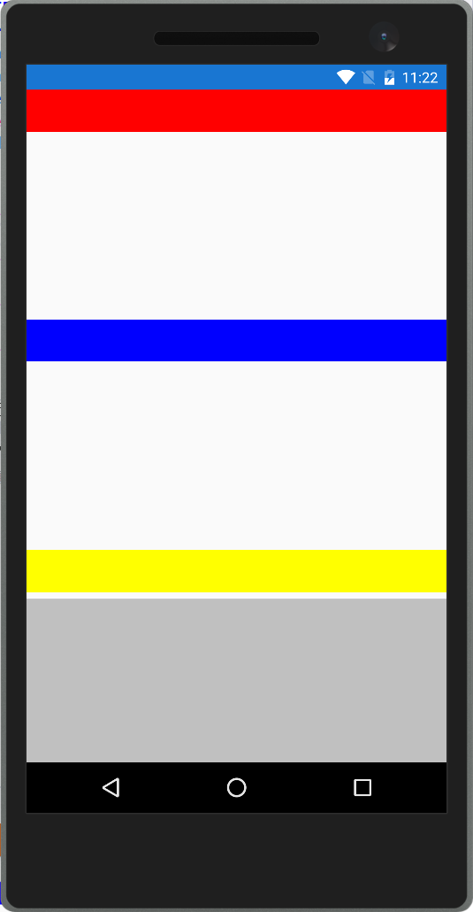

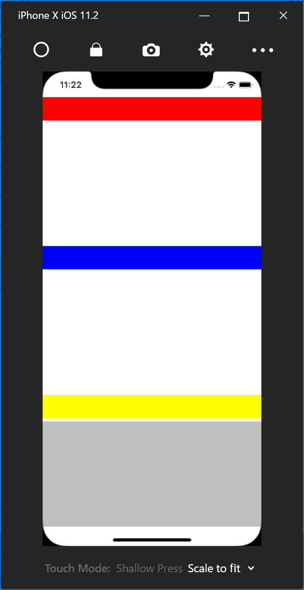

画面が 4 分割されて、それぞれ開始位置、中央、終端、いっぱいに広がるというレイアウトがされていることが確認できます。これを組み合わせてネストさせることで複雑なレイアウトが可能になります。複雑なレイアウトの例を以下に示します。

```xml
<?xml version="1.0" encoding="UTF-8"?>
<ContentPage xmlns="http://xamarin.com/schemas/2014/forms"
             xmlns:x="http://schemas.microsoft.com/winfx/2009/xaml"
             xmlns:local="clr-namespace:HelloWorld"
             xmlns:ios="clr-namespace:Xamarin.Forms.PlatformConfiguration.iOSSpecific;assembly=Xamarin.Forms.Core"
             ios:Page.UseSafeArea="true"
             x:Class="HelloWorld.MyPage">
    <StackLayout VerticalOptions="Start">
        <StackLayout Orientation="Horizontal">
            <BoxView WidthRequest="50"
                     HeightRequest="50"
                     Color="Purple"
                     HorizontalOptions="Center"
                     VerticalOptions="Center" />
            <StackLayout>
                <StackLayout Orientation="Horizontal">
                    <Label Text="名前"
                           FontAttributes="Bold" />
                    <Label Text="@xxxxxxxx" />
                </StackLayout>
                <Label Text="本文本文本文本文本文本文本文本文本文本文本文本文本文本文"
                       VerticalOptions="FillAndExpand" />
                <Label Text="tweeted by sample"
                       VerticalOptions="End" />
            </StackLayout>
        </StackLayout>
    </StackLayout>
</ContentPage>
```

実行すると以下のようになります。ツイッターの1つの呟きのようなレイアウトになります。

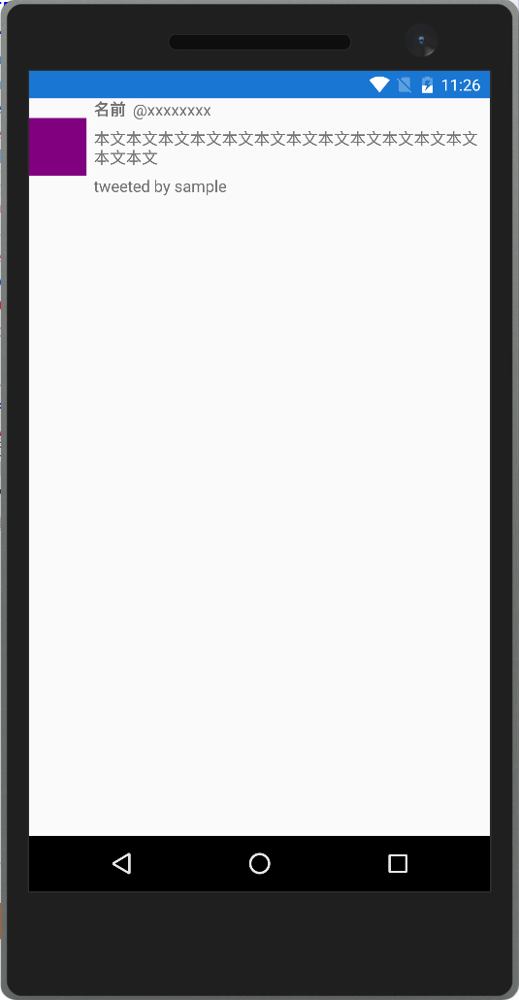

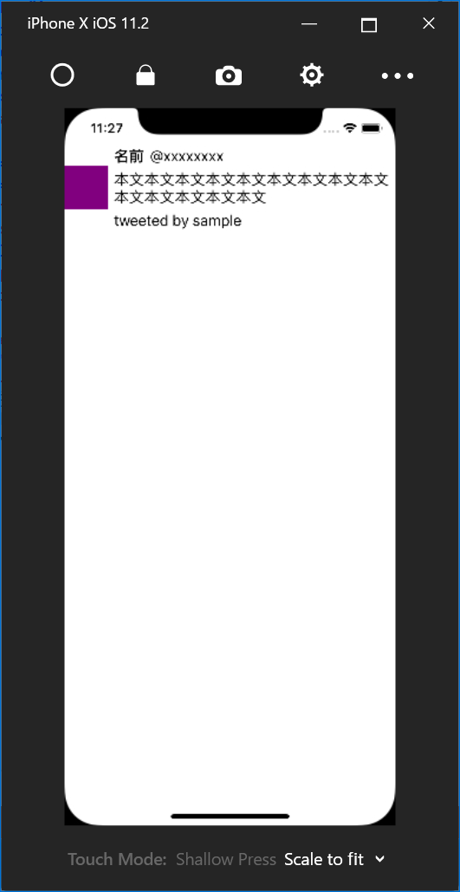

## Grid

Grid は格子状に領域を区切って、そこにコントロールを配置していく方法でレイアウトを行うコントロールです。RowDefinitions プロパティの中に RowDefinition で行を定義して、ColumnDefinitions プロパティの中に ColumnDefinition を指定して列を定義します。RowDefinition には Height プロパティで高さが指定できます。ColumnDefinition には Width プロパティで幅が指定できます。
Height と Width は GridLength という型で固定数値、Auto、数字*という３つの指定方法があります。Autoが中身の大きさに応じてサイズを変える指定方法で、固定数値が指定したピクセル数で表示する方法になります。数字*という指定方法は、余白を比率で分割する指定方法になります。数字の部分を省略した場合は1を指定したことになります。例えば、「3*」と「2*」を指定すると3:2に領域を分割することになります。コントロールをどこに配置するかは Grid.Row 添付プロパティと Grid.Column 添付プロパティで指定します。インデックスは 0 始まりになります。コード例を以下に示します。

```xml
<?xml version="1.0" encoding="UTF-8"?>
<ContentPage xmlns="http://xamarin.com/schemas/2014/forms"
             xmlns:x="http://schemas.microsoft.com/winfx/2009/xaml"
             xmlns:local="clr-namespace:HelloWorld"
             xmlns:ios="clr-namespace:Xamarin.Forms.PlatformConfiguration.iOSSpecific;assembly=Xamarin.Forms.Core"
             ios:Page.UseSafeArea="true"
             x:Class="HelloWorld.MyPage">
    <Grid>
        <Grid.RowDefinitions>
            <RowDefinition Height="50" />
            <RowDefinition Height="Auto" />
            <RowDefinition Height="*" />
            <RowDefinition Height="2*" />
        </Grid.RowDefinitions>
        <Grid.ColumnDefinitions>
            <ColumnDefinition />
            <!-- 指定を省略した時は*になる -->
            <ColumnDefinition Width="100" />
            <ColumnDefinition Width="Auto" />
        </Grid.ColumnDefinitions>
        <!-- 何も指定しないと0,0に配置される -->
        <BoxView Color="Purple" />
        <BoxView Color="Red"
                 Grid.Row="1"
                 Grid.Column="1" />
        <BoxView Color="Blue"
                 Grid.Row="2"
                 Grid.Column="2" />
        <BoxView Color="Yellow"
                 Grid.Row="3"
                 Grid.Column="1" />
    </Grid>
</ContentPage>
```

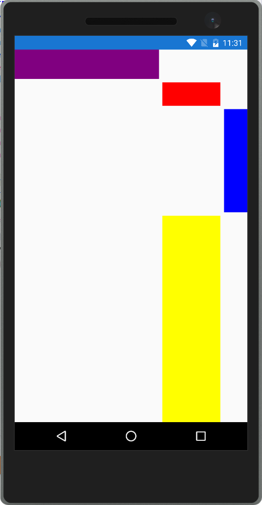

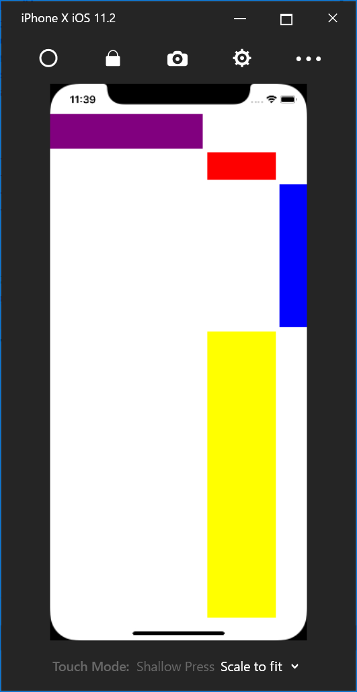


Grid コントロールでは単純にセルの中にコントロールを置くのではなく Grid.RowSpan 添付プロパティと Grid.ColumnSpan 添付プロパティを使って複数のセルに渡って要素を配置することができます。コード例を以下に示します。

```xml
<?xml version="1.0" encoding="UTF-8"?>
<ContentPage xmlns="http://xamarin.com/schemas/2014/forms"
             xmlns:x="http://schemas.microsoft.com/winfx/2009/xaml"
             xmlns:local="clr-namespace:HelloWorld"
             xmlns:ios="clr-namespace:Xamarin.Forms.PlatformConfiguration.iOSSpecific;assembly=Xamarin.Forms.Core"
             ios:Page.UseSafeArea="true"
             x:Class="HelloWorld.MyPage">
    <Grid>
        <Grid.RowDefinitions>
            <RowDefinition Height="50" />
            <RowDefinition Height="Auto" />
            <RowDefinition Height="*" />
            <RowDefinition Height="2*" />
        </Grid.RowDefinitions>
        <Grid.ColumnDefinitions>
            <ColumnDefinition />
            <!-- 指定を省略した時は*になる -->
            <ColumnDefinition Width="100" />
            <ColumnDefinition Width="Auto" />
        </Grid.ColumnDefinitions>
        <BoxView Color="Purple"
                 Grid.RowSpan="3" />
        <!-- 何も指定しないと0,0に配置される -->
        <BoxView Color="Red"
                 Grid.Row="1"
                 Grid.Column="1"
                 Grid.ColumnSpan="2" />
        <BoxView Color="Blue"
                 Grid.Row="2"
                 Grid.Column="2" />
        <BoxView Color="Yellow"
                 Grid.Row="3"
                 Grid.Column="1" />
    </Grid>
</ContentPage>
```

先ほどのコードの一部にGrid.RowSpan添付プロパティとGrid.ColumnSpan添付プロパティを指定しています。実行結果を以下に示します。

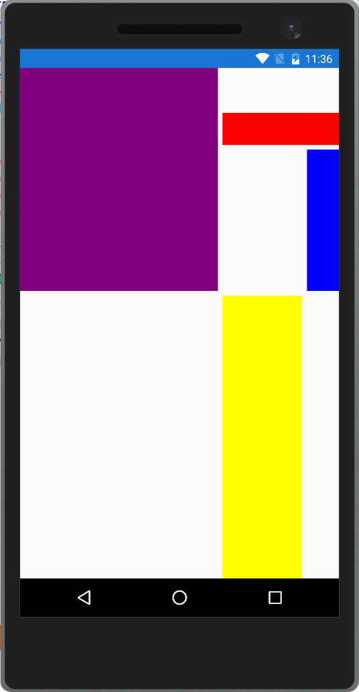

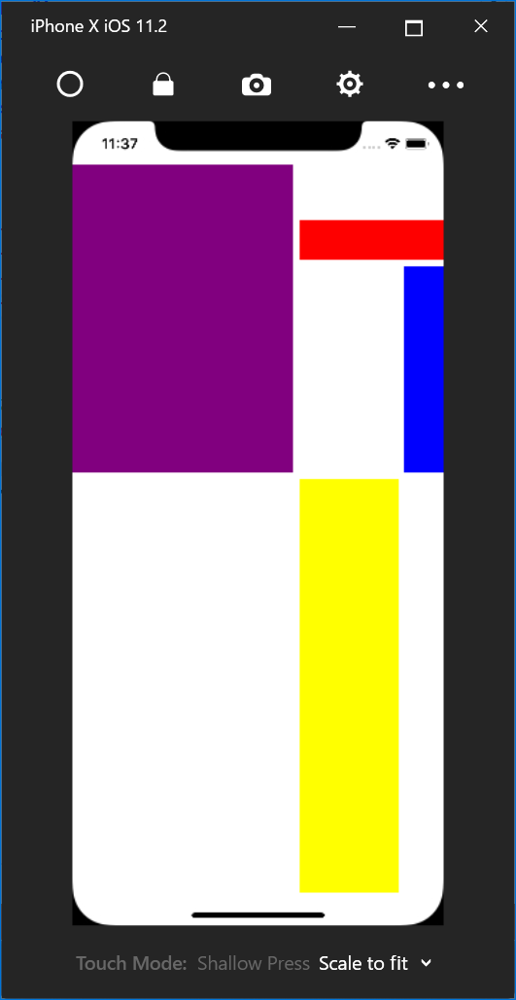

## AbsoluteLayout

AbsoluteLayout は絶対座標と比率でコントロールのレイアウトを指定できるレイアウトコントロールです。AbsoluteLayout.LayoutBounds 添付プロパティで「x, y, width, height」の形式で位置を指定します。この時デフォルトでは絶対座標での指定が行われます。AbsoluteLayout.LayoutFlags 添付プロパティで絶対座標指定か、比率による指定かを設定できます。AbsoluteLayout.LayoutFlags 添付プロパティに指定可能な値は以下のものになります。

- None：デフォルト値。絶対座標による指定になります。
- All：全ての設定値が比率による指定になります。
- WidthProportional：幅が比率による指定になります。
- HeightProportional：高さが比率による指定になります。
- XProportional：X座標が比率による指定になります。
- YProportional：Y座標が比率による指定になります。
- PositionProportional：X座標とY座標が比率による指定になります。
- SizeProportional：WidthとHeightが比率による指定になります。

比率による指定の場合は指定可能な値は 0 〜 1 の間の数字になります。XAML の例を以下に示します。

```xml
<?xml version="1.0" encoding="UTF-8"?>
<ContentPage xmlns="http://xamarin.com/schemas/2014/forms"
             xmlns:x="http://schemas.microsoft.com/winfx/2009/xaml"
             xmlns:local="clr-namespace:HelloWorld"
             xmlns:ios="clr-namespace:Xamarin.Forms.PlatformConfiguration.iOSSpecific;assembly=Xamarin.Forms.Core"
             ios:Page.UseSafeArea="true"
             x:Class="HelloWorld.MyPage">
    <AbsoluteLayout>
        <BoxView Color="Red"
                 AbsoluteLayout.LayoutBounds="10,10,100,100" />
        <BoxView Color="Blue"
                 AbsoluteLayout.LayoutBounds=".5,.5,.5,.5"
                 AbsoluteLayout.LayoutFlags="All" />
        <BoxView Color="Olive"
                 AbsoluteLayout.LayoutBounds="1,.5,25,250"
                 AbsoluteLayout.LayoutFlags="PositionProportional" />
        <BoxView Color="Yellow"
                 AbsoluteLayout.LayoutBounds=".5,1,100,50"
                 AbsoluteLayout.LayoutFlags="PositionProportional" />
    </AbsoluteLayout>
</ContentPage>
```

実行結果を以下に示します。

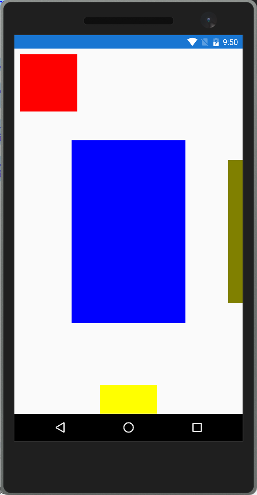

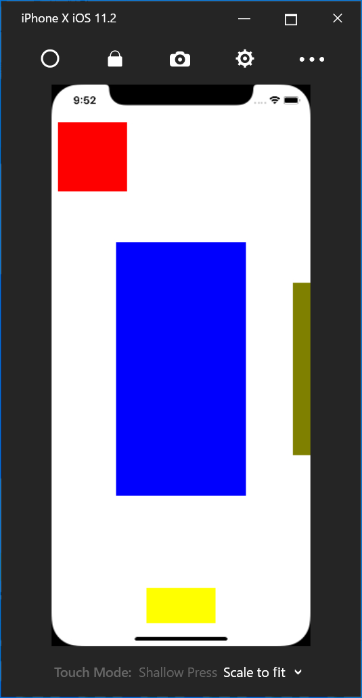

## RelativeLayout

RelativeLayout は親要素か他のコントロールからの相対位置によってレイアウトを決めることができます。以下の添付プロパティを使用して設定します。

- RelativeLayout.XConstraint：コントロールのX座標を指定します。
- RelativeLayout.YConstraint：コントロールのY座標を指定します。
- RelativeLayout.WidthConstraint：コントロールの幅を指定します。
- RelativeLayout.HeihgtConstraint：コントロールの高さを指定します。
- RelativeLayout.BoundsConstraint：コントロールの領域を指定します。

上記の添付プロパティの値は ConstraintExpression マークアップ拡張を使って指定します。ConstraintExpression マークアップ拡張は以下のプロパティを持っています。

- Type：RelativeToParent で親要素を指定するか、RelativeToView で ElementName で指定した View を指定するか設定します。
- ElementName：Type で RelativeToView を指定した時に参照する View の名前(x:Name で指定)を設定します。
- Property：親要素か他の View の、どのプロパティを参照するか指定します。
- Factor：Type と ElementName と Property で取得した値に掛ける比率を指定します。
- Constant：Type と ElementName と Property で取得して Factor を掛けた値に加算する値を指定します。

例えば X 座標を親要素の中央に持ってきたい場合は親要素の幅の半分の値にすればいいので以下のような設定になります。

```xml
RelativeLayout.XConstraint=”{ConstraintExpression Type=RelativeToParent, Property=Width, Factor=.5}”
```

X 座標を boxView の X 座標から 10 増やした位置に指定したい場合は以下のような設定になります。

```xml
RelativeLayout.XConstraint=”{ConstraintExpression Type=RelativeToView, ElementName=boxView, Property=X, Constant=10}”
```

XAML の例を以下に示します。

```xml
<?xml version="1.0" encoding="UTF-8"?>
<ContentPage xmlns="http://xamarin.com/schemas/2014/forms"
             xmlns:x="http://schemas.microsoft.com/winfx/2009/xaml"
             xmlns:local="clr-namespace:HelloWorld"
             xmlns:ios="clr-namespace:Xamarin.Forms.PlatformConfiguration.iOSSpecific;assembly=Xamarin.Forms.Core"
             ios:Page.UseSafeArea="true"
             x:Class="HelloWorld.MyPage">
    <RelativeLayout>
        <BoxView x:Name="boxViewBlue"
                 Color="Blue"
                 RelativeLayout.XConstraint="{ConstraintExpression Type=RelativeToParent, Property=Width, Factor=.5, Constant=-50}"
                 RelativeLayout.YConstraint="{ConstraintExpression Type=RelativeToParent, Property=Height, Factor=.5, Constant=-50}"
                 RelativeLayout.WidthConstraint="{ConstraintExpression Type=RelativeToParent, Property=Width, Factor=.5}"
                 RelativeLayout.HeightConstraint="{ConstraintExpression Type=RelativeToParent, Property=Height, Factor=.5}" />

        <BoxView Color="Red"
                 WidthRequest="100"
                 HeightRequest="100"
                 RelativeLayout.XConstraint="{ConstraintExpression Type=RelativeToView, ElementName=boxViewBlue, Property=X, Constant=-100}"
                 RelativeLayout.YConstraint="{ConstraintExpression Type=RelativeToView, ElementName=boxViewBlue, Property=Y, Constant=-100}" />
    </RelativeLayout>
</ContentPage>
```

画面中央から左上に 50px 動かした位置に青い BoxView を表示しています。そして赤い BoxView を青い BoxView の左上に表示しています。実行結果を以下に示します。

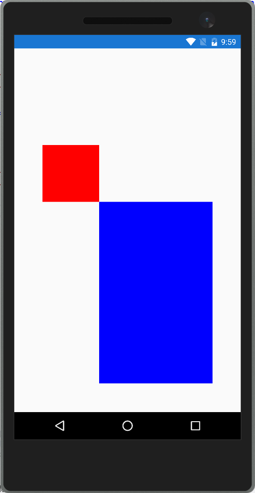

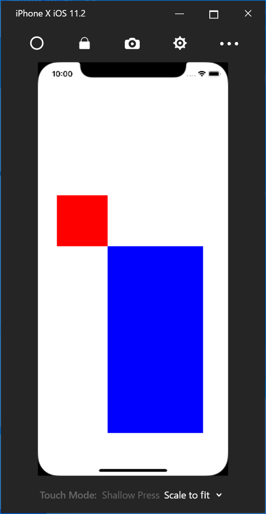

## ScrollView

ScrollView はスクロール可能な領域を提供するコントロールです。他のレイアウトコントロールとは多少毛色が異なりますが Layout を継承しているためここで紹介します。ScrollView は主に以下のプロパティを使用します。

- Content：スクロールさせたいコンテンツを指定します。
- ContentSize：コンテンツのサイズを取得します。（読み取り専用）
- Orientation：スクロールの方向を指定します。ScrollOrientation 型の Horizontal（横方向）、Vertical（縦方向）、Both（両方）が指定可能です。
- ScrollX：スクロールの X の位置を返します。（読み取り専用）
- ScrollY：スクロールの Y の位置を返します。（読み取り専用）

また、スクロール位置を制御するための以下のメソッドが提供されています。

- ScrollAsync(int x, int y, bool animated)
- ScrollAsync(Element element, ScrollToPosition position, bool animated)

最初のオーバーロードが座標指定でのスクロールで2つ目のオーバーロードが要素が表示されるまでスクロールさせるメソッドになります。ScrollToPosition は以下の値を持つ列挙型です。

- Center：中央に表示されるようにします。
- Start：開始位置に表示されるようにします。
- End：終了位置に表示されるようにします。
- MakeVisible：とりあえず表示されるようにします。

コード例を以下に示します。

```xml
<?xml version="1.0" encoding="UTF-8"?>
<ContentPage xmlns="http://xamarin.com/schemas/2014/forms"
             xmlns:x="http://schemas.microsoft.com/winfx/2009/xaml"
             xmlns:local="clr-namespace:HelloWorld"
             xmlns:ios="clr-namespace:Xamarin.Forms.PlatformConfiguration.iOSSpecific;assembly=Xamarin.Forms.Core"
             ios:Page.UseSafeArea="true"
             x:Class="HelloWorld.MyPage">
    <StackLayout>
        <Button Text="Scroll"
                Clicked="ButtonScrollTo_Clicked" />
        <ScrollView x:Name="scrollView"
                    VerticalOptions="FillAndExpand"
                    Orientation="Both">
            <StackLayout>
                <BoxView Color="Red"
                         WidthRequest="500"
                         HeightRequest="500" />
                <BoxView Color="Blue"
                         WidthRequest="500"
                         HeightRequest="500" />
                <BoxView x:Name="boxViewYellow"
                         Color="Yellow"
                         WidthRequest="500"
                         HeightRequest="500" />
                <BoxView Color="Olive"
                         WidthRequest="500"
                         HeightRequest="500" />
            </StackLayout>
        </ScrollView>
    </StackLayout>
</ContentPage>
```

コードビハインドを以下に示します。黄色い BoxView までスクロールを行うように指定しています。

```cs
using System;
using Xamarin.Forms;

namespace HelloWorld
{
    public partial class MyPage : ContentPage
    {
        public MyPage()
        {
            InitializeComponent();
        }
        private async void ButtonScrollTo_Clicked(object sender, EventArgs e)
        {
            await scrollView.ScrollToAsync(this.boxViewYellow, ScrollToPosition.Start, true);
            await DisplayAlert("Info", $"Scroll position is {scrollView.ScrollX}, {scrollView.ScrollY}", "OK");
        }

    }
}
```

実行結果を以下に示します。

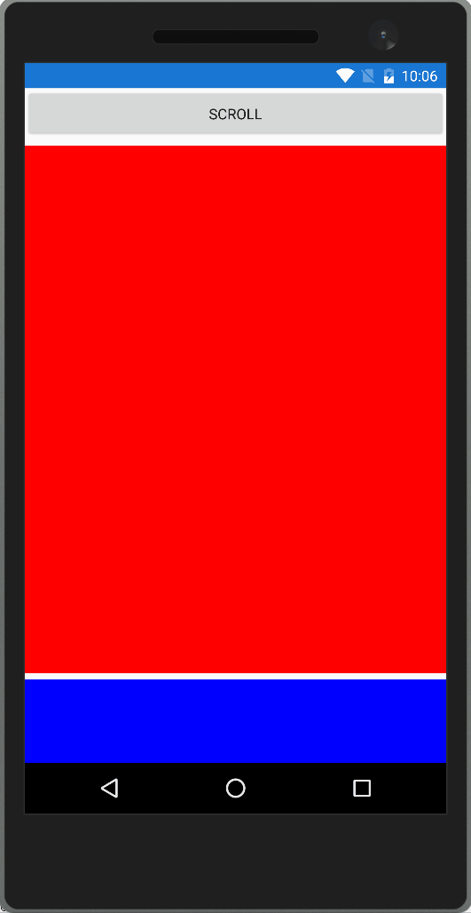

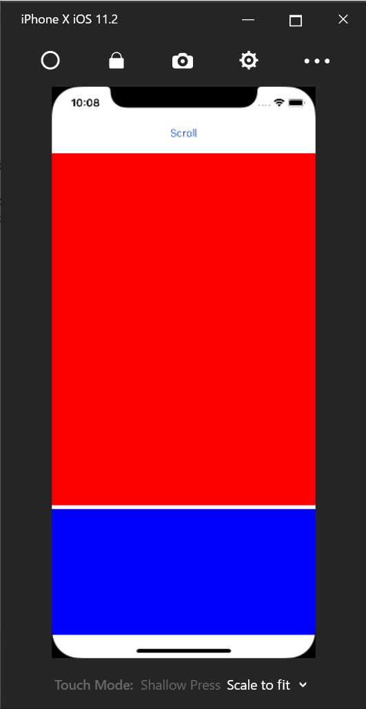

## 余白の制御

Margin プロパティと Padding プロパティを使って余白を制御できます。Margin プロパティがコントロールの外側の余白の指定になります。Padding プロパティがコントロールの内側の余白になります。Margin プロパティも Padding プロパティも Thickness 型で指定可能で、以下の書式です。XAMLでは以下のような形で指定可能です。

- 左,上,右,下
- 左右,上下
- 上下左右

「10,5,10,5」と「10,5」は同じ値を指定していることになります。また「10,10,10,10」と 「10」は同じ指定になります。
